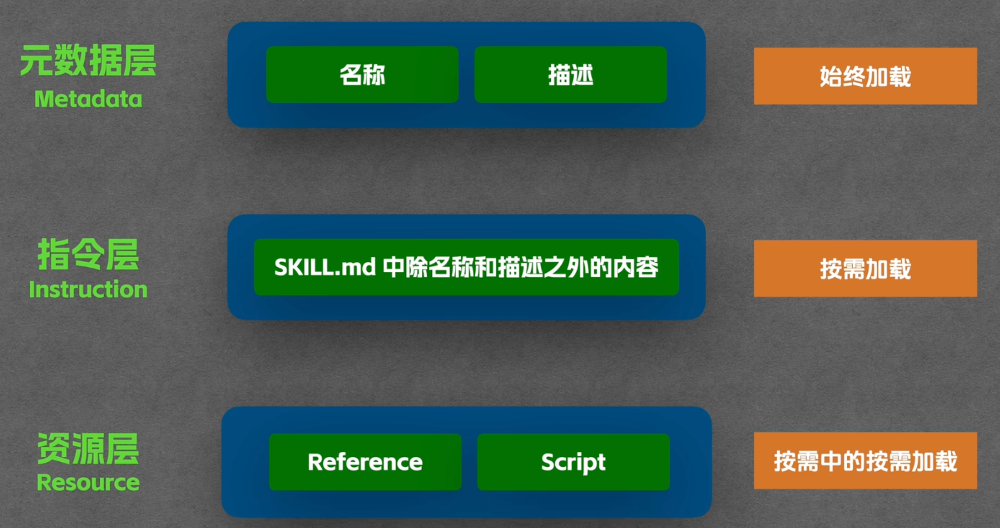
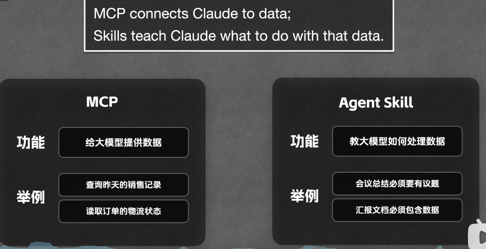

# Agent Skill

+++

### 定义：

* 在 Agent 系统中，**Skill（技能）** 指的是 Agent 能够执行的一个具体能力单元。你可以把它理解为 Agent 的"可调用能力模块"——Agent 通过组合和调度不同的 Skill 来完成复杂任务。

### 与 Tool 的区别

* 简单来说，**Tool 更偏底层**（比如"调用搜索 API"、"执行 Python 代码"），**而 Skill 通常是更高层的抽象，可能封装了多个 Tool 的使用流程**，并包含何时使用、如何使用的策略知识。比如"撰写研究报告"可以是一个 Skill，它内部会调用搜索、阅读、总结等多个 Tool。
* 这个 Skill 完整地体现了我们之前讨论的几个关键概念：它有清晰的 description 来驱动 Skill 路由，有详细的 instructions 来引导 LLM 的行为，有绑定的工具脚本来执行实际操作，有渐进式披露加载的信息架构来管理 context 空间。它不是一个孤立的 prompt，而是**prompt + 工具 + 知识 + 策略**的完整封装。这就是 Skill 和 Tool 的本质区别。

### 组成

一个`SKILL.md`文件再加上scripts脚本文件或者还有一些 .md 子文档

**Skill name + Description** 用自然语言定义这个 Skill 的**能力范围和触发条件**。Agent 的规划模块通过理解这段描述来判断当前任务是否需要调用这个 Skill。

**Prompt 模板（Instructions）** 定义了执行这个 Skill 时 LLM 应该遵循的**具体指令和最佳实践**。这相当于给 Agent 一份"操作手册"。**这些指令在 Skill 被触发时注入到 context 中，引导 LLM 按照最佳实践来执行任务**。

**工具集（Tools）** 绑定了这个 Skill 可以调用的工具可执行脚本。LLM 通过编排器调用这些脚本来实际操作文件

**渐进式披露**：Skill 的信息架构是分层的。 name + description 始终在上下文中，只有确认要用这个 Skill 时才加载主体内容，防止context 浪费

## 渐进式披露机制

