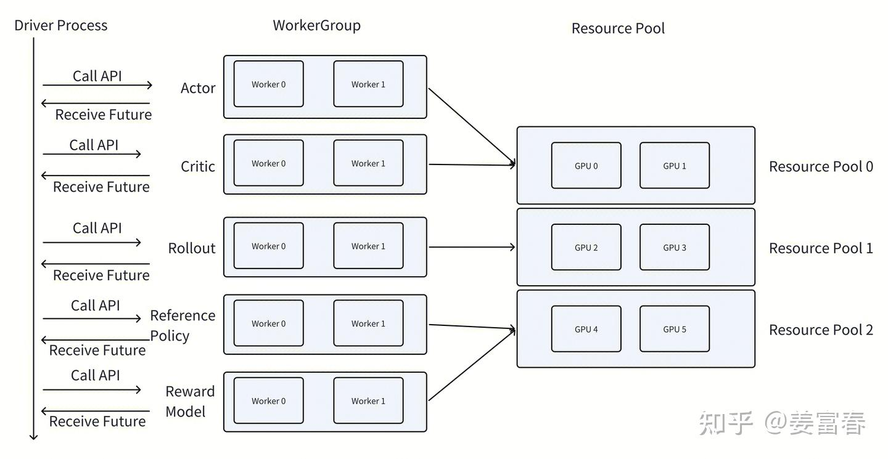
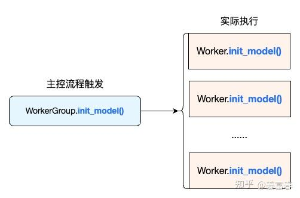
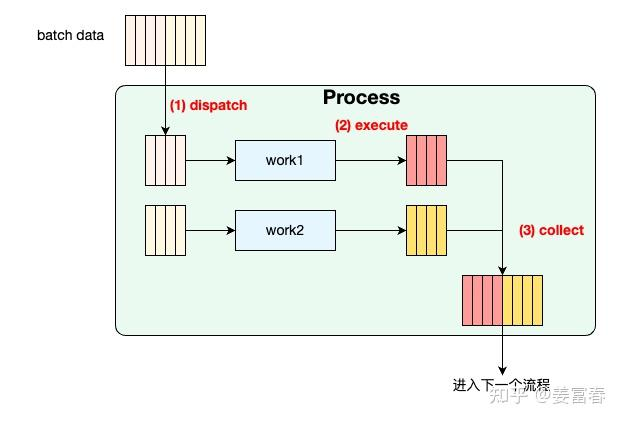
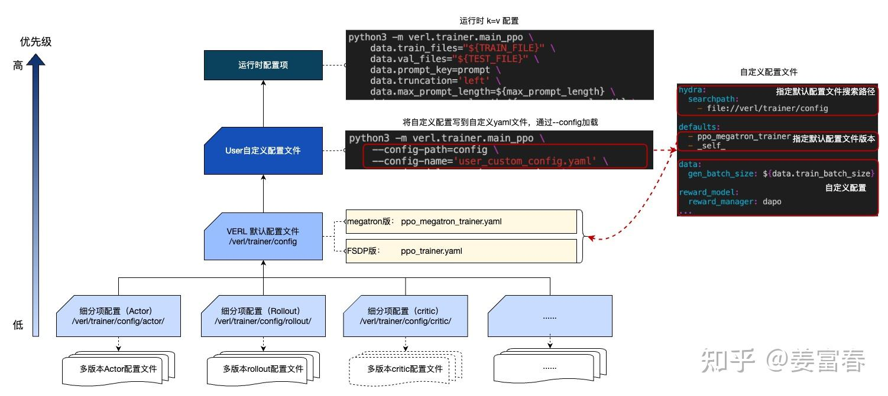

# Code Agent

+++


> LocAgent工具了解一下、基于图的repo关系构建
>
> verl 训练实现过程
>
> meta RL
>
> lora
>
> FSDP（ZeRO-3
>
> 用 规则 reward 替代，规则是什么
>
> vit Qwen
>
> 并行工具调用论文
>
> skill

## 分工

+++

**LocAgent**（`./LocAgent/`）是一个**代码定位 Agent 框架**，来自同名论文。它做三件事：

1. 把代码库解析成有向异构图（含 contains / imports / invokes / inherits 关系）并建 BM25 索引
2. 提供三个核心工具：`search_code_snippets`、`explore_tree_structure`、`get_entity_contents`
3. 提供独立的推理入口（`auto_search_main.py`）和 SFT 监督微调脚本（`sft_train.py`），可以脱离 RL 独立使用

#### 入口文件 `auto_search_main.py`流程

```
main()
  └── localize(args)
        └── run_localize(rank, ...)         ← 多进程并发处理
              ├── set_current_issue(bug)     ← 初始化当前 issue 环境
              ├── 构建 messages（system prompt + task instruction）
              ├── auto_search_process(...)   ← 核心 Agent 循环（子进程）
              │     ├── LLM 调用（litellm）
              │     ├── 解析 response → Action
              │     ├── 执行工具 → 获得 Observation
              │     └── 循环直到 <finish>
              └── get_loc_results_from_raw_outputs()  ← 解析输出
  └── merge(args)
        └── merge_sample_locations()        ← 多次采样结果聚合（MRR/Majority）
```

* 使用`MRR(Mean Reciprocal Rank，平均倒数排序) / majority(多次投票)`对多次采样结果进行融合排序
* `Pass@k`表示对于每个问题，模型生成的 Top-k 的候选答案中，至少一个是与真实答案匹配的概率


## [verl](https://zhuanlan.zhihu.com/p/1931076626940139506)

+++

**VeRL **是字节跳动 seed 团队和香港大学开发的专为大预言模型 post training 设计的高性能、可扩展的强化学习框架。它最核心的特点是采用了 **HybridFlow（混合控制器流）** 的架构，融合**单控制器（Single-Controller）**和**多控制器（Multi-Controller）**，可更好实现和执行多种RL算法，显著提升训练吞吐量，降低开发和维护复杂度。

**设计目标：**在多进程计算环境中保持单进程式的编程简洁性。

**实现方式：**

- WorkerGroup 代理多进程 Worker，通过装饰器封装分布式逻辑。
- 控制器仅需调用高层 API，底层自动处理数据并行和结果聚合。

**Hybrid Flow**：RL的训练逻辑和 Pretrain/SFT 不一样，涉及到多个模型之间的交互和协作。VeRL 将 LLM RL 训练逻辑的 dataflow建模成一个两层的 hybrid flow 问题，进行了解耦，包括：

- **控制流**：位于high-level，使用**单进程**，描述了**多个模型角色之间的交互逻辑**，如actor make experience结束后，Critic、RM、reference开始计算分数，完成后计算 GAE 和相应 oss；

- **计算流**：位于low-level，使用**多进程**，描述了单个**模型角色内部的计算流程**（如前向反向传播、优化器更新、自回归生成等），管理模型的训练和推理具体过程；

  

  > 控制器（Driver Process）在单个进程中运行，而执行器（Rollout, Actor, Critic）等Worker Process会放置在特定的资源组（Resource Pool）中在多个进程中运行。

### 1. 数据协议

`DataProto`是 `verl `中所有 `Worker `之间传递数据的统一容器，规定了所有模块间的数据流转方式。`DataProto`的设计目标是**为强化学习训练中复杂的异构数据流提供一个统一的表示和操作接口**，主要分为：

- **张量数据**：字段 `batch`，类型 `TensorDict`，如 `input_ids`, `attention_mask`, `logits` 等，需要在GPU上进行快速计算。
- **非张量数据**：字段 `non_tensor_batch`，类型 `dict[str, np.ndarry]`，如文本形式的 `prompts`、`responses`、`ground_truth`，或是工具调用的参数、结果等复杂结构。
- **元信息**：字段 `meta_info`，类型 `dict` ，如当前训练步数、模型配置、时间戳等用于跟踪和调试的上下文。

```json
{ // 一条DataProto数据
    // DataProto.batch 模型计算相关
    TensorDict(
        fields={
            "input_ids": Tensor(shape=torch.Size([64, max_seq_len]), device=cpu, dtype=torch.float32, is_shared=False),
            "attention_mask": Tensor(shape=torch.Size([64, max_seq_len]), device=cpu, dtype=torch.float32, is_shared=False),
            "position_ids": Tensor(shape=torch.Size([64, smax_seq_len]), device=cpu, dtype=torch.float32, is_shared=False),
            "raw_prompt_ids": Tensor(shape=torch.Size([64, max_prompt_len]), device=cpu, dtype=torch.float32, is_shared=False)
        },
        batch_size=torch.Size([64]),
        device=None,
        is_shared=False)

    // DataProto.non_tensor_batch 每条样本的附加字段
    {  
        "raw_prompt": [batch],
        "full_prompts": [batch],
        "index": [batch],
        "tools_kwargs": [batch]
    }

    // DataProto.meta_info 全局一些信号
    {
        "temperature": 0.7,
        "top_p": 0.8
    }
}
```


### 2. 分布式调度基础设施（`verl/single_controller`）

> 在传统的分布式训练（如使用PyTorch的DDP）中，你需要手动管理多个进程、处理进程间通信。

`single_controller`是基于 **Ray **构建，但将其底层的多 Actor 调用封装了起来，提供了一套更高级、更简洁的API。

```
single_controller/
├── base/
│   ├── worker.py          # Worker 基类，每个 GPU 进程上跑的对象
│   ├── worker_group.py    # WorkerGroup，对一组 Worker 的统一管理抽象，定义 ResourcePool
│   └── decorator.py       # @register_method 装饰器 + Dispatch/Execute 枚举
└── ray/
    └── base.py            # RayResourcePool, RayWorkerGroup, RayClassWithInitArgs
   
```

> **`decorator.py`** 是整个分布式调用机制的核心。它定义了两类枚举：
>
> - `Dispatch`：控制"如何把数据分发给 Worker"，如 `ONE_TO_ALL`（广播）、`DP_COMPUTE`（按 data-parallel 切分）、`DP_COMPUTE_DATA_PROTO`（切分 DataProto）
> - `Execute`：控制"Worker 返回后如何聚合"，如 `ALL_TO_ALL`、`RANK_ZERO`
>
> 被 `@register_method(dispatch_mode=..., execute_mode=...)` 装饰的方法，Driver 调用时会自动做数据切分、并发发送 RPC、收集结果聚合，完全透明。
>
> **`ray/base.py`** 把上述抽象用 Ray Actor 实现。`RayWorkerGroup` 管理一组 Ray Actor，`spawn()` 方法支持在同一批 GPU 上 colocate 多个角色（ActorRollout + RefPolicy 共享显存）。

* `ResourcePool`：**资源池**，管理跨多节点的计算资源（如GPU），记录每个节点上可用的**进程数量**和**GPU配置**

  * | **类名**             | **说明**                                                     |
    | -------------------- | ------------------------------------------------------------ |
    | `ResourcePool  `     | 基础资源池，管理 process_on_nodes 列表，提供 world_size、local_rank 等计算 |
    | ` RayResourcePool  ` | Ray  实现的资源池，支持 use_gpu=True，封装 Ray 的 PlacementGroup |

* `Worker`：Worker 是所有分布式计算节点的基类，每个 Ray Actor 都继承自 Worker。

  * **WorkerHelper**：提供获取节点 IP、空闲端口的静态方法。
  *  **Worker：** 基础 Worker 类，处理分布式初始化（rank、world_size 配置）、设备管理。
  * **MegatronWorker**：专为 Megatron 并行策略设计的 Worker，处理 TP/PP/DP 分组初始化。

* `WorkerGroup`：它代表一组在分布式环境中的实际 **Worker**（封装一组同构的 Ray Actor），并提供统一的RPC 的调用接口去调用所有 Worker 的方法

  | **类名**                 | **说明**                                                     |
  | ------------------------ | :----------------------------------------------------------- |
  | `WorkerGroup`            | 基础 WorkerGroup，管理多个 Worker 实例，支持 Dispatch/Execute 装饰器批量调用 |
  | `RayWorkerGroup`         | 基于 Ray 的 WorkerGroup 实现，支持 spawn、init_model 等分布式初始化流程 |
  | `ClassWithInitArgs  `    | 延迟实例化的包装器，存储构造参数，在 Worker 节点上远程实例化 |
  | `RayClassWithInitArgs  ` | Ray  版本的  ClassWithInitArgs，用于 Ray Actor 远程构建      |

* `Dispatch / Execute` 装饰器：被装饰的方法，Driver 调用时会自动做数据切分、并发发送 RPC（Remote Procedure Call）、收集结果聚合，完全透明。

  * `@register(dispatch_mode, execute_mode)`：标记 Worker 方法，指定数据如何分发（scatter / broadcast）以及函数的执行方式。

  

**WorkerGroup 的 ==动态方法绑定机制==**：当一个Worker类（如 `ActorRolloutRefWorker`）的方法被 `@register` 装饰器标记后，在其所属的 `WorkerGroup` 初始化时，它会自动为这个方法生成一个分布式版本，并将其绑定到 `WorkerGroup` 身上。

```python
# Worker Process类：Worker 和 WorkerGroup
"""
每个 WorkerGroup 负责管理一组远程运行的 Worker。WorkerGroup 在其构造函数中启动进程。WorkerGroup 作为控制器进程的代理，用于与一组 Worker 进行交互，每个 Worker 都在 GPU 上运行，以执行特定的计算任务。为了实现这一功能，VERL实现了WorkerGroup绑定了一组 Worker 的方法，能通过在控制流中一次调用，触发关联的多个Worker执行远程任务
"""
```

**当一个 Worker 类的方法需要暴露为分布式调用时，开发人员会在方法定义上加上 `@register` 装饰器，并指定调度模式：**

当我们创建 `WorkerGroup` 时（例如通过 `ResourcePool` 实例化一组 Ray Actor），`WorkerGroup` 会遍历底层 Worker 类的所有方法，并执行以下操作：

- 对于每个被 `@register` 装饰的方法，检查其 `__register_info__`。

- **动态生成一个“代理方法”**，并将其绑定到 `WorkerGroup` 实例上。这个代理方法内部封装了完整的分布式调用逻辑。

- 这个动态生成的代理方法，其签名与原始 Worker 方法完全一致，但执行时会自动处理数据分发、并行执行和结果收集。

  > 
  >
  > WorkerGroup Worker 调度执行图

**单个 Process（WorkerGroup 管理下的 worker 组）内部数据处理：**

1. `dispatch_fn` (分发函数)：根据指定的模式，将输入数据拆分或复制，分发给组内的每一个Worker。

2. `execute_fn` (执行函数)：定义在各个Worker在管理的节点上的GPU上函数的执行方式（通常是并行执行）。

3. `collect_fn` (收集函数)：收集所有Worker的执行结果，并将其合并或整理成最终输出。？？

   

**==核心调度模式==**：`single_controller` 支持多种数据分发模式，最常用的两种是 `ONE_TO_ALL` 和 `DP_COMPUTE_PROTO`

| 模式                   | `dispatch_fn` (分发)                                         | `collect_fn` (收集)                                          | 典型应用场景                                                 |
| :--------------------- | :----------------------------------------------------------- | :----------------------------------------------------------- | :----------------------------------------------------------- |
| **`ONE_TO_ALL`**       | **广播**：将相同的输入参数完整地复制并发送给每一个Worker。   | **简单拼接**：将所有Worker的输出简单合并成一个列表。         | 当所有Worker需要基于**相同的信息**执行任务时，例如每个GPU上都有一份完整的模型副本，并同时用不同的数据计算梯度。 |
| **`DP_COMPUTE_PROTO`** | **分片**：将一个大 `DataProto` 数据对象切分成多个小份，每个Worker获得其中一份。 | **合并**：将各个Worker处理后返回的小份 `DataProto` 重新合并成一个完整的 `DataProto`。 | 当数据量巨大，例如在生成（Rollout）阶段，将提示（prompts）数据分发给不同的GPU并行生成响应。 |

#### 底层基础建设：

- **`ResourcePool`** 负责维护全局资源视图，记录每个节点上有多少 GPU、可用端口等。它不直接参与方法调用，而是为 `WorkerGroup` 的创建提供资源分配依据。
- **`Worker` 的实例化**：`WorkerGroup` 在创建时，会利用 `ClassWithInitArgs` 在远程节点上真正启动 Ray Actor。每个 Actor 的初始化参数（如模型配置、rank 等）由 `ResourcePool` 分配的 index 决定。

> | 并行策略            | 切分维度 | 核心思想                                                    | 通信模式                                       | 典型问题                                         |
> | :------------------ | :------- | :---------------------------------------------------------- | :--------------------------------------------- | :----------------------------------------------- |
> | **数据并行 (DP)**   | 数据     | 每个GPU拥有完整模型副本，每个batch切分数据批次并行处理。    | 训练阶段间步（All-Reduce）同步梯度。           | 显存冗余（每个GPU都存一份完整模型）。            |
> | **张量并行 (TP)**   | 层内参数 | 将单层网络的计算任务（如矩阵乘法）切分到多个GPU上共同完成。 | 每层计算内同步（All-Reduce等），通信极其频繁。 | 通信开销极大，对卡间带宽要求高（通常需NVLink）。 |
> | **流水线并行 (PP)** | 层间     | 将模型的不同层分配到不同GPU，数据像流水线一样依次流过各层。 | 点对点（P2P）通信，仅相邻阶段传输数据。        | 存在GPU空闲等待的"流水线气泡"（Bubble）。        |


### 3. 训练引擎

```
trainer/
├── main_ppo.py            # 主入口，Hydra 解析配置，初始化所有组件，调 fit()
├── ppo/
│   ├── ray_trainer.py     # RayPPOTrainer，fit() 训练循环的实现
│   ├── core_algos.py      # 所有 RL 算法的数学实现（advantage, policy loss 等）
│   ├── reward.py          # compute_reward(), load_reward_manager()
│   ├── metric_utils.py    # 计算并收集训练 metrics（token 数、KL、clip ratio 等）
│   ├── utils.py           # Role 枚举，need_critic() 等辅助函数
│   └── rollout_corr_helper.py  # Rollout correction，IS weights 等 off-policy 修正
├── config/
│   ├── config.py          # 全局配置 dataclass（AlgoConfig、TrainerConfig 等）
│   └── algorithm.py       # 算法相关配置
├── fsdp_sft_trainer.py    # 单机 SFT 训练器
├── sft_trainer_ray.py     # 分布式 Ray SFT 训练器
├── main_generation.py     # 独立推理入口（不训练，只生成）
└── evaluate.py            # 评估逻辑


旧架构：
  fsdp_workers.py (Worker)
      ├── 手动初始化 FSDP module + optimizer
      ├── DataParallelPPOActor(module, optimizer)  ← 封装 PPO 算法逻辑
      └── DataParallelPPOCritic(module, optimizer) ← 封装 value 算法逻辑

新架构：
  engine_workers.py (Worker)
      └── engine (FSDPEngine / MegatronEngine)     ← 封装一切底层：模型+优化器+前向反向
              ↑ 通过 set_loss_fn() 注入具体的 PPO/value loss 函数
```

> `core_algos.py` 值得单独说：所有 RL 算法的数学核心都在这里，用注册机制管理：
>
> - Advantage 估计：GAE、GRPO、RLOO、REINFORCE++、ReMax、OPO、GPG 等 10 种
> - Policy Loss：vanilla（标准 PPO clip）、GSPO、SAPO、GPG、clip-cov、kl-cov、geo-mean、CISPO 等 8 种
> - 两个维度正交组合，不改 Trainer 代码就能切换算法
>
> **`engine` 把旧架构里手散在外面的那些事情全收进来了——模型加载、FSDP 包装、optimizer 构建、前向反向传播、权重同步**

训练引擎在 verl 中的核心设计定位是：**为上层算法提供一套无需关心具体并行策略的统一训练接口**。

它的目标是：让你在实现PPO、GRPO等算法时，无需关心模型底层是用了FSDP、Megatron还是其他后端，也无需操心数据是如何在GPU之间切分的

* 核心机制：**SPMD** 模式与 **WorkerGroup** 的协作：

  训练引擎以**SPMD（单程序多数据）**模式运行。这意味着，所有Worker（每个GPU通常对应一个Worker）执行的都是同一份代码，但处理的是不同的数据分片。

  - **在RL训练任务中**：训练引擎被封装在Worker内部，由`single_controller`模块中的`WorkerGroup`进行管理。当`RLTrainer`调用`worker_group.update_actor(data_proto)`时，`single_controller`会根据注册的调度模式（如`DP_COMPUTE_PROTO`）将数据分发给每个Worker，每个Worker内部的训练引擎则负责在本地数据上执行前向/反向计算，并参与梯度的全局同步。这一过程对上层算法完全透明。

* 核心抽象接口：**`BaseEngine`**所有引擎的抽象基类

* 多训练引擎后端实现：

  | 后端                 | 支持的并行策略                                              | 性能与适用场景                                               | 新模型支持时间    |
  | :------------------- | :---------------------------------------------------------- | :----------------------------------------------------------- | :---------------- |
  | **FSDP**             | FSDP (Fully Sharded Data Parallel) + SP (Sequence Parallel) | 对于稠密（Dense）模型性能不错，但对MoE模型效率较低。优点是支持HuggingFace模型**开箱即用**，适合快速迭代和中小规模训练。 | **第0天** (Day 0) |
  | **Megatron (MCore)** | DP+TP+PP+EP+CP (5D并行)                                     | **性能最佳**，专为超大模型（千亿甚至万亿参数）的极致优化设计。但集成新模型的成本也最高，通常需要数周。 | 数周或数月        |
  | **VeOmni**           | FSDP+SP+EP                                                  | 性能和模型支持度介于FSDP和Megatron之间，是一个平衡性选择，目前处于**Alpha测试阶段**。 | 约1周             |

verl同时支持和适配两套训练引擎，即FSDP和Megatron，前者逻辑清晰，且方便支持新的模型结构，research友好；而后者对超大规模（如100B以上）的模型训练更友好，并且参数resharding的开销更小，工程友好；

```python
# Driver Process 类：RayPPOTrainer
"""
RayPPOTrainer类扮演着Driver Process的角色， 它负责初始化并构建 Worker 和 WorkerGroup ，同时运行 PPO 算法的主循环，RayPPOTrainer 的 fit 函数是以单进程形式运行。WorkerGroup将在其指定的资源池（Resource Pool）上构建。资源池可以理解是 Ray 集群中的一组 GPU。
"""
```

#### 3D-HybridEngine 的协作

训练引擎是verl引以为傲的**3D-HybridEngine**（3D混合引擎）的核心组成部分。在Actor模型的训练中，3D-HybridEngine实现了**分时复用**：

1. **生成阶段 (Rollout Mode)**：训练引擎的状态会被 **`Offload`（卸载）**到CPU，将宝贵的GPU显存和算力全部让给生成引擎（如vLLM），以最快速度生成数据。	
2. **训练阶段 (Training Mode)**：数据生成完毕后，释放生成引擎，训练引擎再从CPU**加载**回GPU，全力进行梯度计算和参数更新。
3. **动态重分片 (Dynamic Resharding)**：由于生成和训练可能采用不同的并行配置（如生成用TP=1，训练用TP=4），训练引擎在加载时需要与`Checkpoint Engine`协同，高效地在设备间重新排布模型参数，实现“零内存冗余”和“最小化通信开销”。

`BaseEngineCtx / EngineTrainModeCtx / EngineEvalModeCtx`：训练/推理模式切换的 Context Manager，在进入/退出时自动处理参数和优化器状态的 CPU offload，实现训练与 Rollout 之间的内存共享复用。

### 4. VeRL 配置管理

VERL框架使用了Hydra来管理配置项，**Hydra** 是 Meta 开发的一个基于 Python 的开源配置管理工具，专为机

器学习等复杂项目设计。它通过**分层组合**的方式，解决了传统 `argparse` 或单一 `yaml` 难以管理成百上千参数的问题。



+++

`AsyncLLMServerManager`负责管理与多个 OpenAI 兼容的 LLM 服务器之间的异步通信，并同时提供**负载均衡**和**粘性会话**两大核心功能。

- **负载均衡**：当有多个 LLM 服务器实例时，需要将请求均匀地分散到各个服务器上，避免单个服务器过载。
- **粘性会话**：在多轮对话中，后续的生成请求应该尽量发送到与第一轮相同的服务器上，以便利用服务器的**前缀缓存（prefix caching）**，从而加速推理。

为此，它内部维护了一个最小堆（用于实现最少请求数优先的负载均衡）和一个 LRU 缓存（用于记录每个 `request_id` 对应的服务器，实现粘性）。


