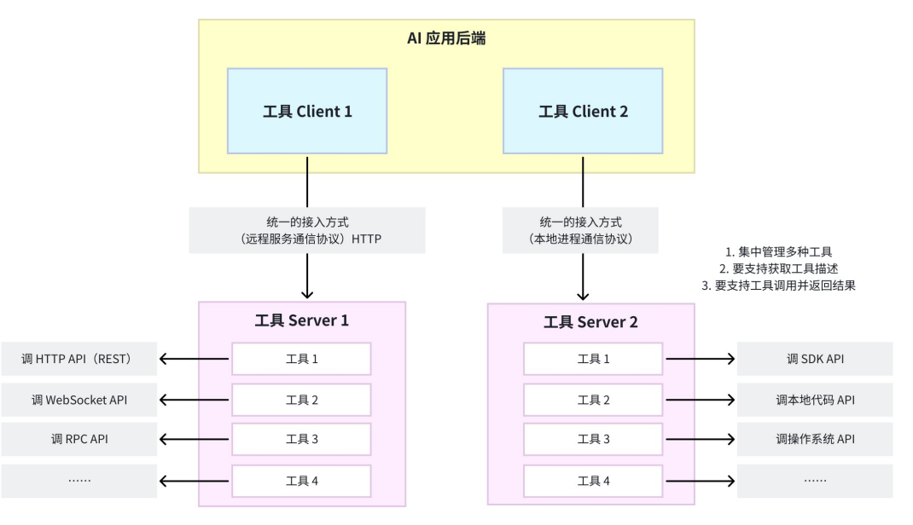
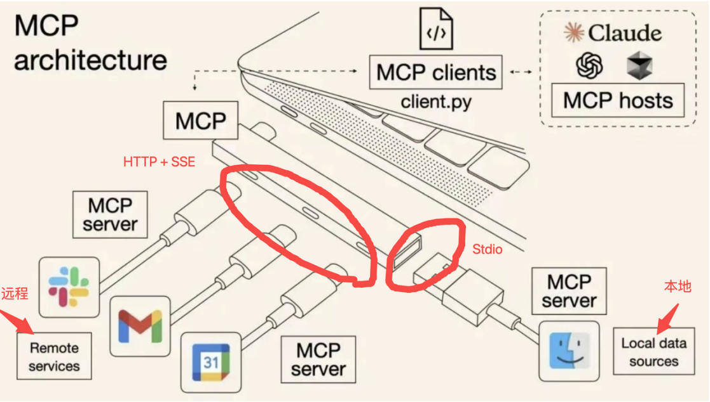
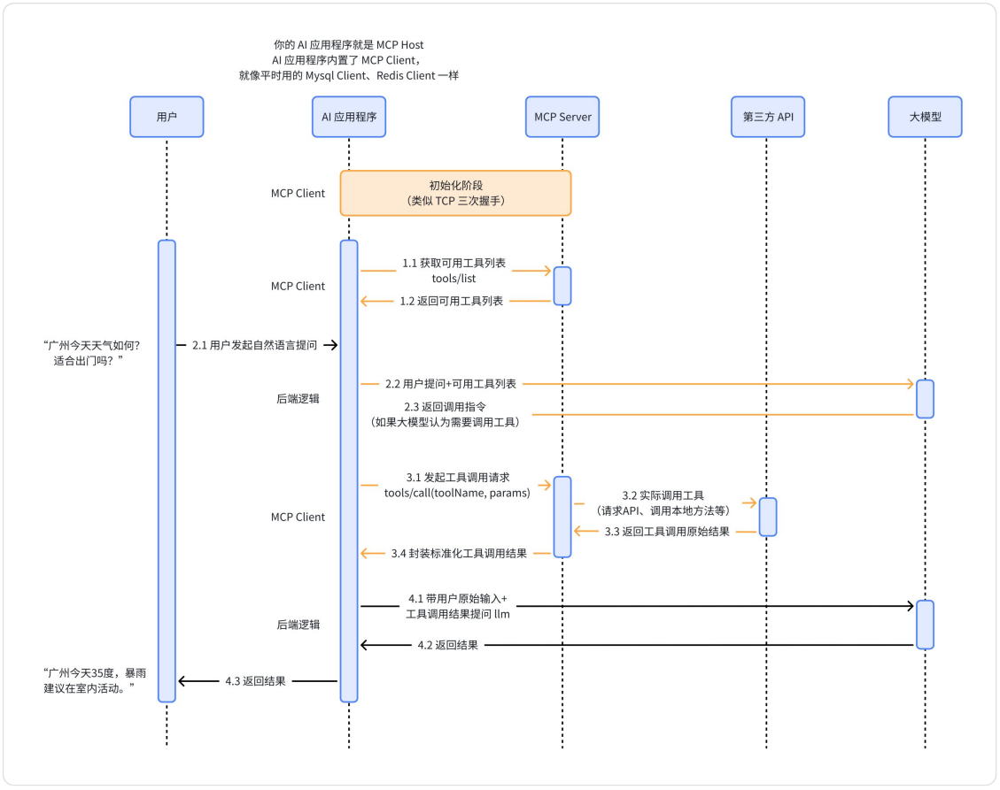

# MCP（Model Context Protocol 模型上下文协议）

+++

> 大模型本身只会问答，不会使用外部工具
>
> MCP提出的背景：
>
> 1. 工具接入的冗余开发问题：接入别人开发的工具需要copy完整代码和函数描述
> 2. 工具复用困难：由于环境、依赖问题，新工具无法在本地使用、跨语言的代码、很多企业不想暴露源码
>
> **MCP协议规定了如何发现和调用函数即 MCP Host 与 MCP Server 之间的交互，MCP就算脱离大模型也可以使用，MCP本身没有规定与模型的交互方式**

## MCP 协议是什么

2024 年 11 月由 Anthropic（一家美国人工智能初创公司）提出

* MCP 是一个开放协议，用于**标准化应用程序**向**大语言模型**（LLM）提供**上下文**的方式。MCP 提供了一种将 AI 模型连接到不同**数据源**和**工具**的标准化方式。

  > 上下文：指的是模型在决策时可访问的所有信息，如当前用户输入、历史对话信息、外部工具 （tool）信息、外部数据源（resource）信息、提示词（prompt）信息等等。

  

## MCP 核心架构

当 MCP Host 需要连接到一个 MCP Server 时，会实例化一个 MCP Client 对象来维护此连接，从而保持 MCP Host 与 MCP Server 一对一关系

### MCP Host

* Host 更像是一个 agent，协调和管理一个或多个 MCP Server 的人工智能应用程序。
* 会将用户的 question 和 Server 中已有的工具一起提供给模型

### MCP Server

* 一个为 MCP Client 提供上下文的程序

* Server 给 Host 提供可用的Tool（由实例化对象Client来维护），大部分的 Server 都是通过输入输出（stdio）来与 Host 进行传输
* 启动程序：

  * Python——uvx
  * Dode——npx

### MCP Client

* 一个组件，用于维护与 MCP 服务器的连接，并从 MCP Server 获取上下文，供 MCP Host 使用

### MCP Tool

Tool 更像是函数，输入参数，返回结果

## MCP 传输协议

### Stdio 传输（本地）

> Stdio 传输本是上是**本地进程间通信**（IPC）的一种形式，最常用的底层机制就是**管道**（pipe）

* **stdio**：是进程的**标准输入/输出接口**
* **pipe**：操作系统内核提供的一种进程间通信机制，它允许一个进程的输出直接作为另一个进程的输入，实现数据在两个进程之间的流动

### HTTP + SSE ——> Streamable HTTP （远程）

> 客户端通过 HTTP POST 向服务端发请求，服务端通过 SSE 通道返回响应结果。

*  SSE（Server-Sent Events服务器发送事件），是一种服务器单向推送数据给客户端的技术，基于 HTTP 协议。
* 基本原理：
  1. 客户端先向服务端发起一个普通的 HTTP 请求
  2. 服务端保持这个连接不断开，以`text/event-stream`作为响应类型，流式写入数据
  3. 客户端收到数据后会触发相应的事件回调（比如浏览器全段实时更新界面）
* 与普通 HTTP 的核心差异：支持服务端**主动、流式**地推送消息
* 服务端推送的重要性：MCP Server 中的工具发生了更新，需要主动向 MCP Client 推送通知

> SSE 最初是为浏览器准备的，浏览器原生支持，拿来即用。但是，一旦离开浏览器，在 Python、Java、Go 等语言里，如果要消费 SSE 流，得用三方库解析`text/event-stream'协议,而不同语言的库成熟度差别很大，有的只支持基本功能，不支持断线重连、心跳等等。Streamable HTTP 的优势在于，几乎所有语言都有成熟的 HTTP客户端(如 Java:Httpclient、Go:net/http等等)，这些库天然支持 chunked transfer 或 HTTP/2 流。MCP 选择 Streamable HTTP，就是为了保证 跨语言、跨平台、可扩展。

* Streamable HTTP 并不是一个标准协议名，而是一个通用描述，指的是基于 HTTP 协议的“可流式传输”技术。它的核心思想是：在一个 HTTP 连接里，服务端可以持续不断地发送数据给客户端，客户端边接收边处理，类似“流”一样。
* Streamable HTTP 取代 HTTP + SSE 原因：
  1. 数据格式限制：SSE 的 `Content-Type: text/event-stream` 只支持文本格式； Streamable HTTP 的 `Content-Type` 支持任意格式，如 JSON、HTML、二进制等，更适合 AI 场景（可能要传 JSON + 音频 + 图片）
  2. 跨平台兼容问题：SSE 支持的客户端主要是浏览器端和少量语言库；而 Streamable HTTP 支持多 种客户端
  3. 性能问题：SSE 是基于 HTTP/1.1 长连接，Streamable HTTP 可以基于 HTTP/2/3 ，支持多路复用 和双向流。且 HTTP/2/3 的流控制和优先级机制使得高吞吐和低延迟成为可能；SSE 消息只能文本 格式，Streamable HTTP 支持其他采用更紧凑的编码方式（比如二进制分包、压缩等）。

## 技术实现：

1. **工具与AI应用必须解耦合**

   客户端 - 服务端架构（MCP Host、MCP Client、MCP Server）

2. **工具与AI之间的交互必须标准化**

   * AI 应用和工具服务的**通信协议**需要统一（本地进程间的通信协议 / 远程服务调用的协议）

     本地：Stdio 传输；远程：HTTP + SSE 或 Streamable HTTP

   * AI 应用和工具服务的**接口定义**需要统一（需要提供哪些接口、接口需包含哪些参数）

     工具服务需提供的接口：

     1. `tools/list`（用于返回方法列表） 
     2. `tools/call`（用于执行方法并返回结果）
     3. `notifications/tools/list_changed`（服务端主动推送，用于告知客户端方法更新）

   * AI 应用和工具服务的**数据交换格式**需要统一（接口的请求 / 响应格式等)

     JSON-RPC 2.0：是一种轻量级的远程过程调用（RPC）协议，基于 JSON 格式进行通信，主要特点是所有消息都是 JSON 格式，便于解析和跨语言使用。

   * AI 应用接入工具的**配置内容**需要进行标准化定义

+++

## MCP + Function Calling 工作流程

