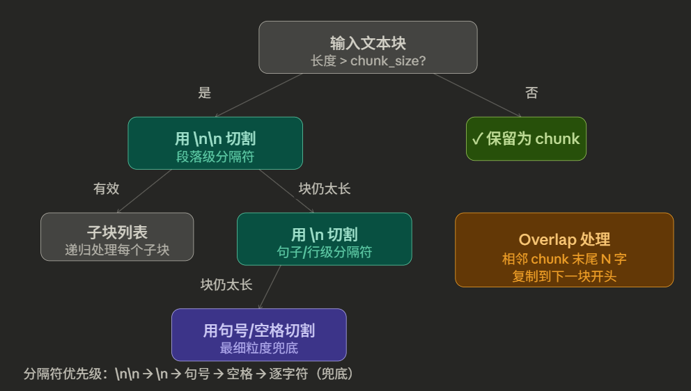
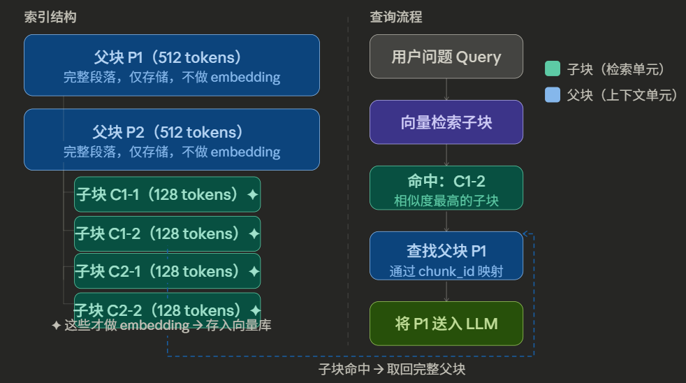
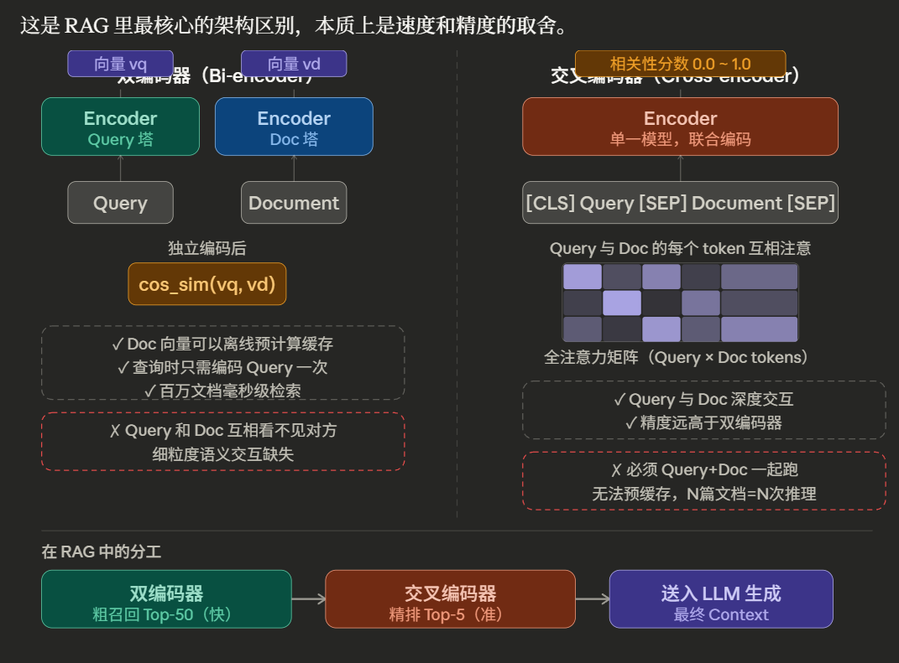
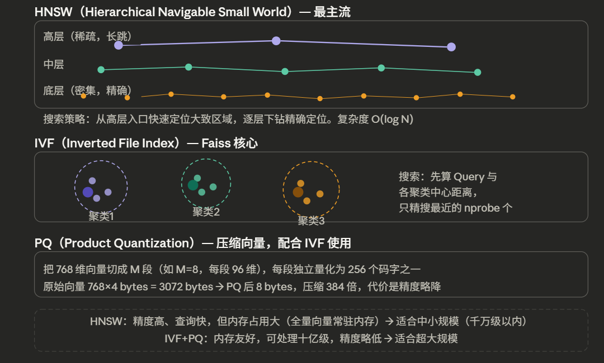
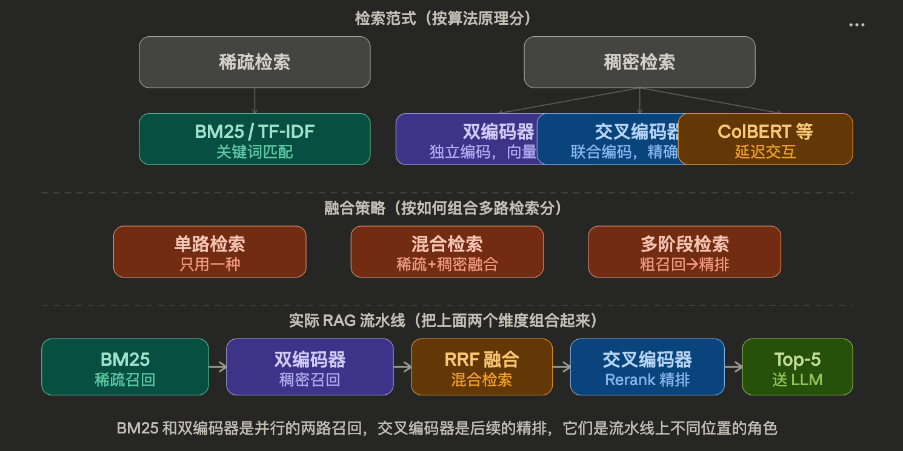
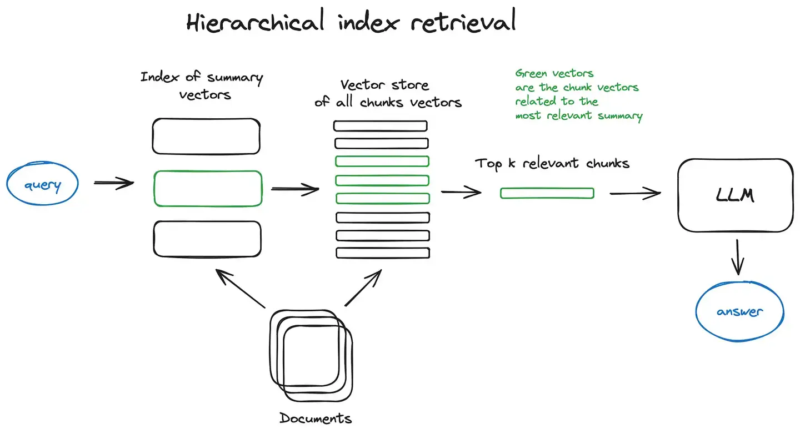
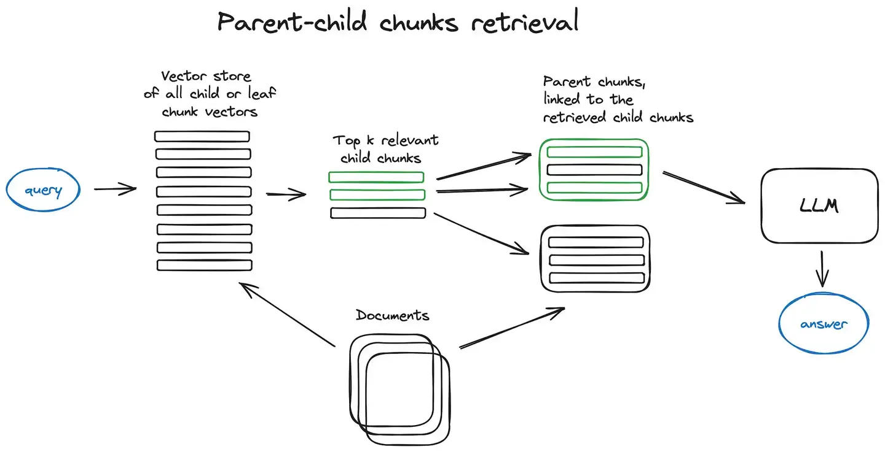
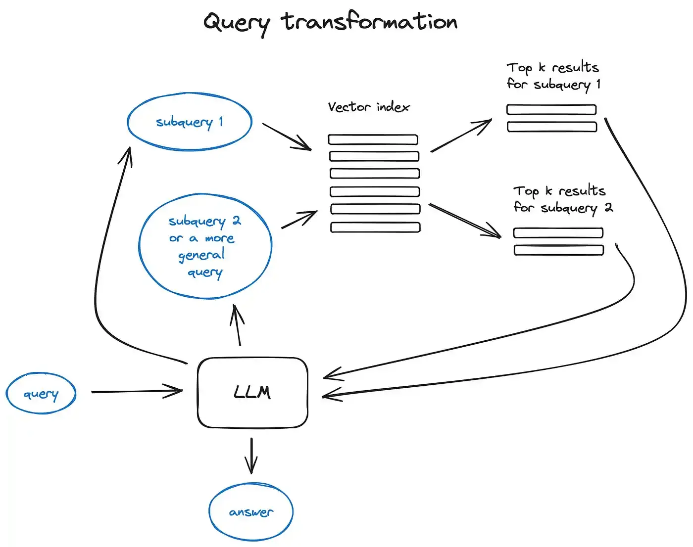
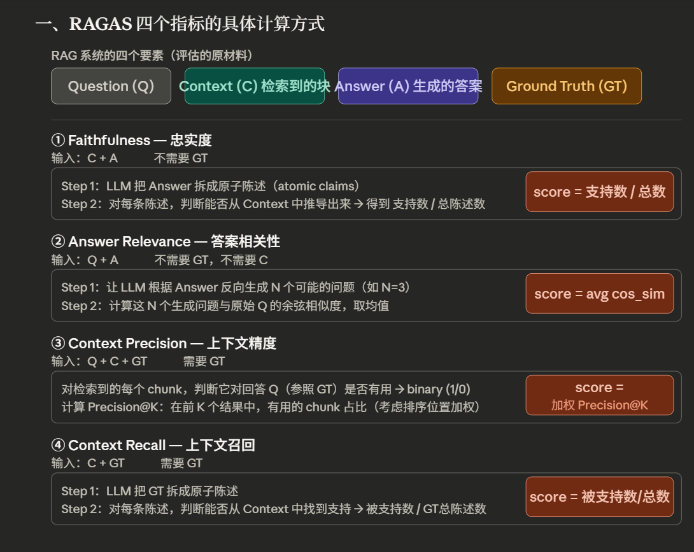

# RAG（Retrieval Augmented Generation）

+++

> 它的核心思路是：**不把知识加入训练数据集，而是在推理时动态检索外部知识库，再由模型生成答案**
>
> 每当将大模型应用于实际业务场景时发现，通用的基础大模型基本无法满足实际业务需求，主要有以下几方面原因：
>
> - **知识的局限性**：大模型自身的知识完全源于训练数据，而现有的主流大模型（deepseek、文心一言、通义千问…）的训练集基本都是构建于网络公开的数据，对于一些实时性的、非公开的或私域的数据是没有。
> - **幻觉问题hallucination**：所有的深度学习模型的底层原理都是基于数学概率，模型输出实质上是一系列数值运算，大模型也不例外，所以它经常会一本正经地胡说八道，尤其是在大模型自身不具备某一方面的知识或不擅长的任务场景。
> - **数据安全性**：对于企业来说，数据安全至关重要，没有企业愿意承担数据泄露的风险，尤其是大公司，没有人将私域数据上传第三方平台进行训练会推理。这也导致完全依赖通用大模型自身能力的应用方案不得不在数据安全和效果方面进行取舍。
>
> 
>
> 把外部文档和问题一同作为prompt输入模型，会产生一些问题：
>
> 1. 模型的上下文窗口大小限制
> 2. 推理成本高
> 3. 模型推理慢

## RAG的基本流程

**离线索引阶段( Indexing)：**数据准备一般是一个离线的过程，主要是将私域数据向量化后构建索引并存入数据库的过程。

* **预处理**：外部文档的数据中，比如PDF中的表格、图片、页眉页脚都可能会引入噪声，需要专门`parser`，（如 `pdfplumber`、`unstructured`）处理。

  > PDF 本质上是一个**排版描述语言**，它存储的不是"这是一篇文章"，而是"在坐标 (x=120, y=340) 处画一个字符'A'"。
  >
  > 基于 `pdfminer`，精确提取每个字符的坐标、字体、大小。优势是**对表格提取很强**——它能通过字符位置推断行列关系。适合结构规整的 PDF。
  >
  > `unstructured`更"高层"的框架，内部会自动判断元素类型，输出带**语义标签**的结构：

* **分块（文本分割，chunking）**

  ​	文本分割主要考虑两个因素：1）embedding模型的Tokens限制情况；2）语义完整性对整体的检索效果的影响。
  ​	目前虽然一些LLM的上下文窗口很大，但是对于文本来说，一个或几个句子的向量总比一个大块文本的向量更能体现其语义信息。因此，对私域文档进行chunking就很有必要
  一些常见的文本分割方式如下：

  1. 语义分割（Semantic chunking）：

     ​	基于句子嵌入相似度找切割点，语义边界更自然。每个句子独立embedding成高维向量，如果相邻句子相似度（余弦）差异过大/或取分布低谷点，就截断。

  2. 递归分块（Recursive / Hierarchical）：

     ​	用一组有优先级的分隔符**层层尝试切割**，优先保留大结构（chunk_size），实在太长（超过size）才往小结构切。

     

     `chunk_size` 是硬约束，但切割点永远优先选"最大的语义单元"——能用段落切就不用句子切

     `overlap` 的作用是防止关键信息恰好落在两个 chunk 的边界上被割断，相邻 chunk 会共享一段尾部文字

     这个策略**不需要 embedding**，纯字符串操作，速度极快，是工程上最常用的默认方案

  3. 固定长度分割（Fixed-size）：

     ​	根据embedding模型的token长度限制，将文本分割为固定长度（例如256/512个tokens），这种切分方式会损失很多语义信息，一般通过在头尾增加一定冗余量来缓解。

  4. 父子块（Parent-Child）：

     * 小块用于精确检索，大块用于完整上下文输入——这是 LlamaIndex 中的经典设计。
     * 父子块本质上都是用递归分块，只是chunk_size不一样，并且子块是在父块下进行分块的，永远不会超过父块边界，子块存储时用“字符偏移量char offset”建立父子映射。

     

     ​	块的大小（chunk size）和重叠（overlap）是超参数，通常 chunk 在 256–1024 tokens，overlap 50–200 tokens。

* **向量化（embedding）**

  ​	向量化是一个使用嵌入模型（embedding model 几乎都是 encoder-only 架构，因为双向注意力天然适合理解全文语义）将文本chunk数据转化为高维向量的过程。

  ​	原始 BERT 预训练目标是 **MLM（Masked Language Modeling）**——预测被遮住的词，这让它理解了语言，但直接拿 `[CLS]` token 的向量算句子相似度效果很差（向量空间各向异性，随便两句话相似度都很高）。

  ​	所以需要**专门的 fine-tune**，主流方法是**对比学习（Contrastive Learning）**：

  > 损失函数：一个batch中一条正例对+所有其他样本作为负例（Query，Negatives），
  >
  > * InfoNCE（Information Noise-Contrastive Estimation 信息噪声对比度估计）：
  >
  >   $-\mathbb{E}\left[\log\frac{\exp(sim(x,x^+)/\tau)}{\exp(sim(x,x^+)/\tau)+\sum_{i=1}^N\exp(sim(x,x_i^-)/\tau)}\right]$
  >
  > * Triplet Loss（三元组损失）
  >
  > * 本质上是一个N选1的分类问题。
  >
  > 加了一个temperature超参数，τ 小（如 0.05）→ softmax 更尖锐 → 对"稍微近一点的负例"惩罚更重 → 训练信号更强，但容易不。InfoNCE 为什么更好，因为我主要解决的是Hard Negative——看起来相关但实际不相关的

  * 通用模型：`text-embedding-3-large`（OpenAI）、`bge-m3`（BAAI，中文友好）

  * 领域微调：对专业文本（法律、医疗），通用 embedding 效果下降，需要 fine-tune

  * 双编码器 vs. 交叉编码器：双编码器（Bi-encoder）速度快。但 Query 和 Document 是分开编码的，最终只是两个向量之间做点积/余弦运算。这意味着它们在编码过程中**完全不知道对方的存在**，适合粗召回；交叉编码器（Cross-encoder）速度慢，Query 的每个 token 都能直接"看到"Doc 里的每个 token——这种**全注意力交互**让模型能捕捉到非常细粒度的语义匹配，比如指代关系、同义词、隐含逻辑。适合 rerank。

    

* **向量数据库**（Vector Store）

  ​	向量数据库存储主流选型：Faiss（本地）、Pinecone、Weaviate、Qdrant、Milvus。除向量之外，还要存储 metadata（文档来源、章节、时间戳等）用于过滤。
  
  

**在线查询阶段( Querying)**：根据用户的提问，通过高效的检索方法，召回与提问最相关的知识，并融入Prompt；大模型参考当前提问和相关知识，生成相应的答案

* **Query**：用户问题

* **Query Rewrite**：用户的原始问题往往口语化、模糊。

  1. **HyDE（Hypothetical Document Embedding）**：让 LLM 先生成一个假设性的答案文档，再用这个文档去检索——因为问题向量和答案向量在空间中往往不对齐
  2. **Query Decomposition**：将复合问题拆成多个子问题分别检索
  3. **Step-back prompting**：先让模型问更抽象的上层问题

* **查询向量化（query embedding）**

* **检索（Retriever）**

  ​	常见的数据检索方法包括：相似性检索、全文关键字检索等，根据检索效果，一般可以选择多种检索方式融合（混合检索），提升召回率。

  1. 相似性检索：即计算查询向量与所有存储向量的相似性得分，返回得分高的记录。常见的相似性计算方法包括：余弦相似性、欧氏距离、曼哈顿距离、点积等。

  2. BM25 全文检索：全文检索是一种比较经典的检索方式，在**数据存入时，通过关键词构建倒排索引**；在检索时，通过关键词进行全文检索，找到对应的记录。

     TF-IDF 加权分 = TF*IDF	**tf是词频(Term Frequency)**，**idf为逆向文件频率(Inverse Document Frequency**)。

  3. 混合检索：用 RRF（Reciprocal Rank Fusion）或加权融合两路结果

     1. RRF（Reciprocal Rank Fusion）：用各自排名的倒数和来计算该文档得分（Σ  1 / (k + rank_i(doc))），k的存在用来平滑，削弱某一路排名极高主导性。

        **RRF 的优点**：完全不用调参（除了 k），不受两路分数量纲影响，对异常高分不敏感，工程上极为稳健。这是它被广泛采用的核心原因

     2. 加权融合（Weighted Score Fusion）：都先进行归一化，再加权求和。

        **问题在哪**：归一化对**异常值极度敏感**。假设 BM25 中有一篇文档得分 100，其余都在 10 以下，归一化后那篇文档独占 1.0，其他全压缩到 0.1 以下——整个排序被这一个异常值破坏。这是加权融合在实践中比 RRF 差的根本原因。
        
        

* **重排(reranking)**

  ​	Bi-encoder 粗召回的 Top-K（如 50 个）中，用 cross-encode 编码器精排出 Top-N（如 5 个）。例如：`bge-reranker`

* **上下文拼接（Context building）**

  ​	利用 prompt engineering 将检索到的上下文与query一起拼接为prompt

  ​	Context Compression：用 LLM 对每个 chunk 进行摘要压缩，减少 token 消耗

  ​	Prompt 模板：明确告诉模型"仅依据以下资料回答，若无依据请说不知道"

* **生成（Generation）**

* 

  

+++

## 其他RAG相关技术

* 分层检索（分层索引）：对于大型数据库，创建两个索引，一个由摘要组成，一个由文档块组成，通过摘要先过滤掉一部分文档
  
* 内容增强：这里的内容增强是指在检索过程中，将检索到的上下文进行增强，以实现检索较小的块也能获得较好的搜索效果。主要就两种思路：一种是扩展：扩展较小块的上下文；还有一种是使用父子块
  * 语句窗口检索器：将上下文窗口扩展为检索到的句子前后K个句子
  * 自动合并检索器（父文档检索器）：文档拆分为较小的子块和父块，子块和父块有引用关系。如果前k个检索到的块中有n个链接到同一个父块，则将父块替换子块成为上下文
    
* 查询转换（query transformation）:利用LLM推理引擎来修改user输入来提高检索质量
  
  利用original query生成多个sub query，这些子查询并行执行检索，最后将结果合并作为prompt上下文提示词中

**评测**

## 进阶架构：Agentic RAG

传统 RAG 是单次检索——如果一次检索不够，就没有机会修正。**Agentic RAG** 引入了推理循环：

1. **Iterative Retrieval**：模型生成答案后，判断是否充分，若不充分则再次检索
2. **Multi-hop Reasoning**：问题需要跨多个文档推理，每一跳的检索结果作为下一跳的输入
3. **Tool-use RAG**：检索只是众多工具之一，模型自主决定何时检索、检索什么、如何整合

这是 RAG 发展的前沿方向，代表框架有 LangGraph、LlamaIndex Workflows。
