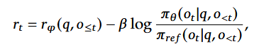

# RLHF(Reinforcement Learning from Human Fedback)

+++

* RLHF并不能解决所有LLM中的真实性和毒性问题

## 如何工作

* 与SFT相比，数据准备：

  

* 第一阶段：收集Preference Datast 人类偏好数据集
* 比较难的一点就是偏好也是个人化的，并不是人类的，所有你的标注者的偏好选择应该与你的task相适应（模型更有用、毒性少、更积极等）

* 第二阶段：训练建立模型

  

  

* 奖励模型也是一个LLM模型，本质上是一个回归模型

* 极大似然估计

  

* 第三阶段：

  
  
  

+++

## PPO

* Value Neural Network
* Policy Neural Network

+ 黄色是**Train Models**，蓝色是**Frozen Models**

+ **四个模型**：

  1. 目标模型是**Actor Model / Policy Model**；
  2. 其中参考模型是SFT模型；
  3. 奖励模型是在SFT模型最后一个transformer block的输出（隐藏向量）加一个线性层，生成单一的奖励标量，也需要训练
  4. 价值模型**Value Model / Critic Model**也是需要训练的，用于

+ **Reward Model**

  > [1]  “Direct preference optimization: Your language model is secretly a reward model,” 
  >
  > July 29, 2024 [10.48550/arXiv.2305.18290](https://doi.org/10.48550/arXiv.2305.18290).
  >
  > [2]  “Training language models to follow instructions with human feedback,” 
  >
  > Mar. 04,202210.48550/arXiv.2203.02155](https://doi.org/10.48550/arXiv.2203.02155).

​	BT模型用于建立偏好模型，可以将问题定义为一个二元分类问题，得到负对数似然损失：

​	损失函数：$\mathrm{loss}\left(\theta\right)=-\frac{1}{\binom{K}{2}}E_{(x,y_w,y_l)\sim D}\left[\log\left(\sigma\left(r_\theta\left(x,y_w\right)-r_\theta\left(x,y_l\right)\right)\right)\right]$

​	防止奖励模型的过度优化，对奖励计算增加了一个KL散度

* **Value Model**

  价值模型用于预测期望总收益V，它与奖励模型的差别在于奖励模型预测的是生成token的即时收益；**本质上，其实是想要让价值$V_t$有真值和预测值，RM是认定为真实的**

  

  **价值函数**：$$V_t=R_t+\gamma V_{t+1}$$

  **引入优势**：$Adv_t=R_t+\gamma*V_{t+1}-V_t$；再加上未来优势：$Adv_t=(R_t+\gamma*V_{t+1}-V_t)+\gamma*\lambda*Adv_{t+1}$

​	$J_{PPO}(\theta)=\mathbb{E}[q\sim P(Q),o\sim\pi_{\theta_{old}}(O|q)]\frac{1}{|o|}\sum_{t=1}^{|o|}\min\left[\frac{\pi_\theta(o_t|q,o_{<t})}{\pi_{\theta_{old}}(o_t|q,o_{<t})}A_t,\mathrm{clip}\left(\frac{\pi_\theta(o_t|q,o_{<t})}{\pi_{\theta_{old}}(o_t|q,o_{<t})},1-\varepsilon,1+\varepsilon\right)A_t\right]$

> **PPO 中“1 个 batch 用于 ppo-epochs 次 loss 计算”的本质，是在固定旧策略和经验分布的前提下，对同一批高成本采样数据进行多次受限策略优化，从而在不增加 rollout 成本的情况下显著提升样本利用效率。**
>
> on-policy 数据的复用。
>
> PPO 的设计是用同一批采样数据更新 K 次，第一次 mini-batch 时 ratio 确实为 1，从第二次开始参数已经变了，ratio 开始偏离，Clip 机制就是为了防止多次更新后偏离过大

> **在 LLM 的 PPO/RLHF 框架中，尽管奖励模型仅对完整生成序列给出一个终止奖励，但该奖励被视为 episode 末端的稀疏回报，并通过价值函数估计与广义优势估计（GAE）机制沿 token 时间轴向前传播，从而为每个 token 构造对应的优势信号，实现序列级奖励到 token 级策略更新的信用分配。**
>
> 

+++

## GRPO

$\begin{aligned} \mathcal{J}_{GRPO}(\theta) & =\mathbb{E}[q\sim P(Q),\{o_{i}\}_{i=1}^{G}\sim\pi_{\theta_{old}}(O|q)] \\ & \frac{1}{G}\sum_{i=1}^G\frac{1}{|o_i|}\sum_{t=1}^{|o_i|}\left\{\min\left[\frac{\pi_\theta(o_{i,t}|q,o_{i,<t})}{\pi_{\theta_{old}}(o_{i,t}|q,o_{i,<t})}\hat{A}_{i,t},\mathrm{clip}\left(\frac{\pi_\theta(o_{i,t}|q,o_{i,<t})}{\pi_{\theta_{old}}(o_{i,t}|q,o_{i,<t})},1-\varepsilon,1+\varepsilon\right)\hat{A}_{i,t}\right]-\beta\mathrm{D}_{KL}\left[\pi_{\theta}||\pi_{ref}\right]\right\}, \end{aligned}$

对于每个问题 $q$，我们从 **旧策略模型** $\pi_{\theta_{\text{old}}}$ 中采样出 $G$ 个输出 $\{o_1, o_2, \dots, o_G\}$

* 结果监督（Outcome Supervision）：每个输出通过 **奖励模型** $r_\varphi$ 进行打分，得到相应的奖励 $r_1, r_2, \dots, r_G$。这些奖励会被 **标准化**，通过从每个奖励中减去该组奖励的 **均值**，并除以 **标准差**

  $\tilde{r}_i=\frac{r_i-\mathrm{mean}(r)}{\mathrm{std}(r)}$

* 过程监督（Process Supervision）：输出 $o_i$ 由 $K_i$ 个步骤构成，那么对于每个步骤 $j$，对应的奖励 $r_j^{\text{index}(j)}$ 会被计算，并且每个奖励会被 **标准化**

  $\tilde{r}_i^{\mathrm{index}(j)}=\frac{r_i^{\mathrm{index}(j)}-\mathrm{mean}(R)}{\mathrm{std}(R)}$

  优势 $A_{i,t}$ 是通过 **每个步骤的奖励** 和 **后续步骤的奖励** 计算的。每个 token 的优势是由其对应的步骤奖励的累加结果来计算的：

  $A_{i,t}=\sum_{j\geq t}\tilde{r}_i^{\mathrm{index}(j)}$

  
