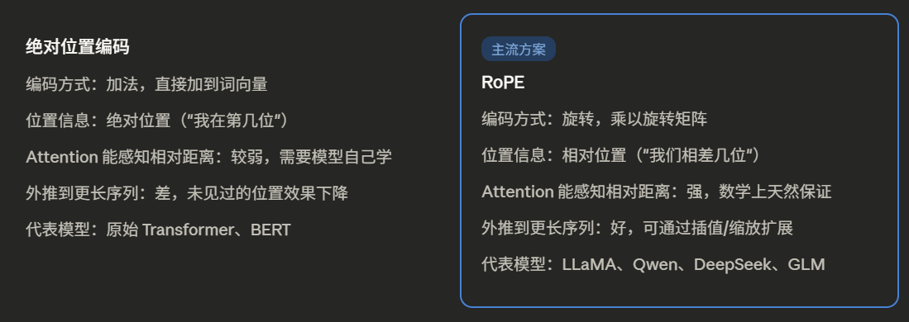

# Transformer

+++


这里有一些新的感悟：就是在计算当前时刻下token的V时，是根据当前时刻前所有token的V加权求和再加上残差连接计算出来的，即就是在当前token原始V下进行了语义上偏离，这是根据前文的语义计算出来的当前文本情景下的token的V，由此通过线性矩阵转换到词汇表中下个预测此的得分，通过softmax概率选择下一个token。

* 解码器中，是一个一个输出的，这种形式的输出叫做自回归（auto-regressive），意思就是过去时刻的输出也是这个时刻的输入

* batch norm 和 layer norm 的区别：

  

  由于每一个样本的大小不一样，小批量batch的均值和方差抖动较大：

  layer norm 是计算每个样本的均值和方差，也不需要计算全局的均值和方差

* 解码器带掩码的注意力机制是为了训练的时候看不到t时间之后的输入，保证训练和预测的行为是一致的

* attention只注意各个token之间的相关性，比如你输入的顺序打乱，其实输出的是一样的QKV，所以要加入时序信息也就是positional encoding

* 训练中的正则化：Residual Dropout、Label Smoothing


### embedding

* 我们需要把文字转换为token再转换为计算机能看懂的向量，如果选择传统的目标识别那种one-hot的稀疏向量，确实可以实现，但是这样的向量都是正交的，无法建立向量之间的关系。
* 因此，选择使用**稠密向量**，每个维度的无法解释，但是我们可以形象的去理解。
* 通过在向量空间中的“距离”，可以定义两个向量之间的关系

### Positional Encoding

**绝对位置编码：Sinusoidal 函数**


* 这里 `i` 是维度的下标，`d` 是向量总维度。每个维度用一个不同频率的正弦波来记录位置，低维度变化快（区分相邻位置），高维度变化慢（区分长距离位置）

* **绝对位置编码的优缺点**

  ​	优点很明显：简单，不需要训练参数（Sinusoidal 版本），而且理论上可以推广到训练时没见过的更长序列。

  ​	但有一个根本性的缺陷：它编码的是"我在第几个位置"，而不是"我和另一个词相差几个位置"。对于 Attention 来说，真正有用的往往是相对关系——"主语距动词多远"比"主语是第5个词"重要得多。绝对位置编码做不到这一点。

* 角频率w按几何级数递减，既能表示局部，又能覆盖长距离

* 特点：

  

**RoPE（旋转位置编码）**

* RoPE 是目前主流大模型（LLaMA、Qwen、ChatGLM 等）普遍采用的方案，它解决了绝对位置编码的问题。

* 核心直觉：**用旋转来编码位置

* RoPE 的想法非常优雅：**不是把位置加到词向量上，而是按位置把词向量旋转一个角度**。

* 位置 `m` 的词向量，就在二维平面上旋转 `m × θ` 度。这样，**当 Attention 计算 query 和 key 的点积时，位置信息会自然地以"相对差"的形式体现出来。**

* ```
  θ_i = 1 / 10000^(2i/d)
  ```

* 经过推导，这个点积的结果只依赖于 `(m - n)`，也就是两个位置之间的距离，而不是各自的绝对位置。

* 和正弦编码类似，高维用慢频率覆盖长距离，低维用快频率覆盖短距离



**Context length 外推：**

1. 位置插值（Position Interpolation，PI）：对序列长度进行等比缩放，代价是**相邻 token 的角度差变小了一半**，近距离的位置区分度下降
2. NTK-Aware 插值：PI 的问题是所有维度对都等比例压缩，但实际上快速维度对（θ 大）才是角度溢出的主要原因，慢速维度对根本没问题。NTK-Aware 的思路：**修改 θ 的底数**，旋转频率，让低维度的角度旋转对变慢一些，高维度对基本不动。
3. YaRN：
   * 慢速维度对（维度高，θ 小）：本来就不会溢出，**不动**
   * 中速维度对：做 NTK 风格的旋转频率调整
   * 快速维度对（维度低，旋转频率高，容易溢出）：做位置插值压缩

### 对于Mask并不是很理

* padding mask
* causal mask

### attention

* 本质上就是观察其他token在句子中对自己的影响大小，同时来调整自己的语义

+++

## encoder-decoder

交叉注意力机制
