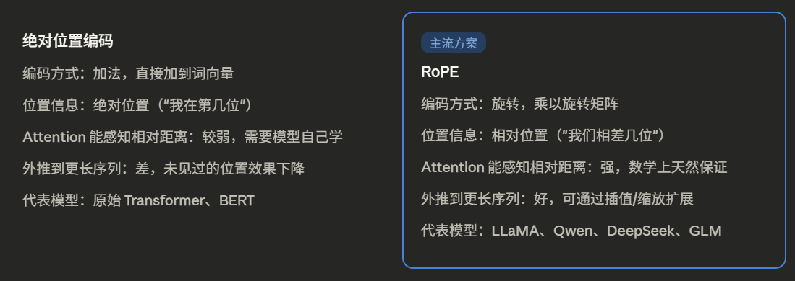
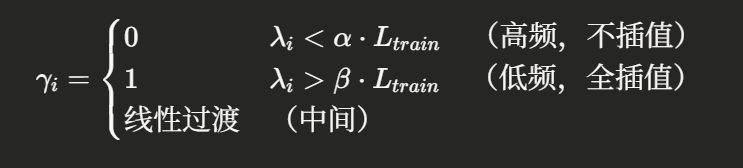

# Transformer

+++


这里有一些新的感悟：就是在计算当前时刻下token的V时，是根据当前时刻前所有token的V加权求和再加上残差连接计算出来的，即就是在当前token原始V下进行了语义上偏离，这是根据前文的语义计算出来的当前文本情景下的token的V，由此通过线性矩阵转换到词汇表中下个预测此的得分，通过softmax概率选择下一个token。

* 解码器中，是一个一个输出的，这种形式的输出叫做自回归（auto-regressive），意思就是过去时刻的输出也是这个时刻的输入

* batch norm 和 layer norm 的区别：

  

  由于每一个样本的大小不一样，小批量batch的均值和方差抖动较大：

  layer norm 是计算每个样本的均值和方差，也不需要计算全局的均值和方差

* 解码器带掩码的注意力机制是为了训练的时候看不到t时间之后的输入，保证训练和预测的行为是一致的

* attention只注意各个token之间的相关性，比如你输入的顺序打乱，其实输出的是一样的QKV，所以要加入时序信息也就是positional encoding

* 训练中的正则化：Residual Dropout、Label Smoothing


### embedding

* 我们需要把文字转换为token再转换为计算机能看懂的向量，如果选择传统的目标识别那种one-hot的稀疏向量，确实可以实现，但是这样的向量都是正交的，无法建立向量之间的关系。
* 因此，选择使用**稠密向量**，每个维度的无法解释，但是我们可以形象的去理解。
* 通过在向量空间中的“距离”，可以定义两个向量之间的关系

### Positional Encoding

**绝对位置编码：Sinusoidal 函数**


* 这里 `i` 是维度的下标，`d` 是向量总维度。每个维度用一个不同频率的正弦波来记录位置，低维度变化快（区分相邻位置），高维度变化慢（区分长距离位置）

* **绝对位置编码的优缺点**

  ​	优点很明显：简单，不需要训练参数（Sinusoidal 版本），而且理论上可以推广到训练时没见过的更长序列。

  ​	但有一个根本性的缺陷：它编码的是"我在第几个位置"，而不是"我和另一个词相差几个位置"。对于 Attention 来说，真正有用的往往是相对关系——"主语距动词多远"比"主语是第5个词"重要得多。绝对位置编码做不到这一点。

* 角频率w按几何级数递减，既能表示局部，又能覆盖长距离

* 特点：

  

**RoPE（旋转位置编码）**

* RoPE 是目前主流大模型（LLaMA、Qwen、ChatGLM 等）普遍采用的方案，它解决了绝对位置编码的问题。

* 核心直觉：**用旋转来编码位置

* RoPE 的想法非常优雅：**不是把位置加到词向量上，而是按位置把词向量旋转一个角度**。

* 位置 `m` 的词向量，就在二维平面上旋转 `m × θ` 度。这样，**当 Attention 计算 query 和 key 的点积时，位置信息会自然地以"相对差"的形式体现出来。**

* ```
  θ_i = 1 / 10000^(2i/d)
  ```

* 经过推导，这个点积的结果只依赖于 `(m - n)`，也就是两个位置之间的距离，而不是各自的绝对位置。

* 和正弦编码类似，高维用慢频率覆盖长距离，低维用快频率覆盖短距离



**Context length 外推：**

RoPE中，对于位置m，是进行一个mθ角度的旋转。推理时，如果序列长度大于训练中的最大长度，模型没见过那么大旋转角，就会导致性能急剧下降，无法外推

RoPE 不同维度有不同频率，

* 高频维度（i 小）：旋转频率高，旋转快，相邻位置差异大。在 4096 步内已经转了很多圈 → 训练充分
* 低频维度（i 大）：旋转频率低，旋转慢，长距离才有差异。在 4096 步内可能转不到半圈 → 训练不充分，外推时完全陌生

1. 位置插值（Position Interpolation，PI）：对序列长度进行等比缩放，超长序列的位置 **线性压缩 **回模型见过的长度范围。代价是**相邻 token 的角度差也会等比缩小**，近距离的位置区分度下降

2. NTK-aware Scaling 插值：PI 的问题是所有维度对都等比例压缩。NTK-Aware 的思路：不应该均匀压缩所有频率，而应该**高频少压缩（保留局部感知），低频多压缩（扩展全局范围）** 。通过引入一个比例系数对**基础旋转频率**进行修正

   * 高频维度：旋转角几乎不变  → 局部信息保留
   * 低频维度：旋转角大幅缩小 → 全局范围扩展

3. YaRN（Yet another RoPE extensioN）：

   1. NTK-by-parts（非均匀插值）

      把每个维度按波长分成高频、低频、中间三类，高频完全不插值保留局部感知，低频完全插值扩展范围，中间线性过渡，比静态 NTK 更精细
      $$
      \lambda_i = \frac{2\pi}{\theta_i} \quad \text{（维度 i 的波长）}
      $$
      

      

      修正后的旋转频率：
      $$
      h(\theta_i) = (1 - \gamma_i)\frac{\theta_i}{s} + \gamma_i \theta_i
      $$

   2. 温度缩放：序列变长后注意力分数分布会变尖锐，YaRN **引入一个随缩放比例增大的温度因子来平滑注意力分布**，防止信息过度集中在少数 token

      * YaRN 引入温度因子 $\sqrt{t} $ 对注意力分数缩放：

      $$
      \text{Attention} = \text{softmax}\left(\frac{QK^T}{\sqrt{d_k} \cdot \sqrt{t}}\right)V \\t=0.1lns+1（s 为缩放比例）
      $$

      * 序列越长，温度越高，注意力分布越平滑，防止信息过度集中。

   3. 少量长文本微调：大约 400 步就能让模型充分适应新的位置分布

      

      

### 对于Mask并不是很理

* padding mask
* causal mask

### attention

* 本质上就是观察其他token在句子中对自己的影响大小，同时来调整自己的语义

+++

## encoder-decoder

交叉注意力机制
