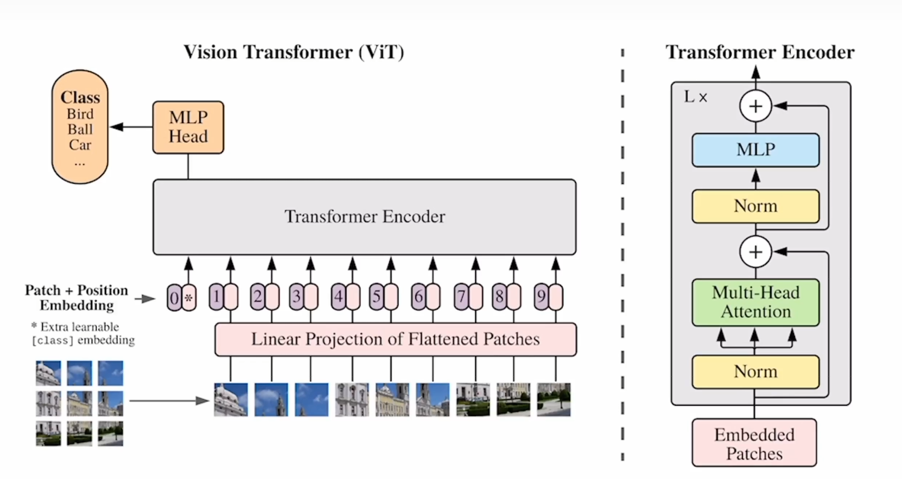

# ViT（Vision Transformer）

+++

在VIT中应用效果好，在CNN中应用不好的情况：

- 遮挡（Occlusion）
- 数据偏移（Distribution shift）
- Adversarial patch
- Permutation

同等规模的VIT和CNN相比，VIT要弱一点。主要原因是：Transformer缺少归纳偏置（inductive biases）。CNN中有两个归纳偏置：Locality和平移等变性（translation equivariance）

## 相关工作

* 相较于文本，图像领域的自注意力是平方复杂的
* 如果要在图像领域使用自注意力，就得做一定程度的近似（approximations）
  * 使用一个小窗口（local neighborhoods）
  * Sparse Transformer：只对一些稀疏的点做自注意力
  * 轴自注意力：在横轴和竖轴上进行自注意力

## Method

### 线性投射层E：768x*768（D）*

* 前面的768是由图像的patch算出来的，16x16个patch，再加上3通道；
* 每个序列前面都有**[CLS]token**，所有线性投射层输出的是**197x768**
* 在 ResNet50 中输出的是一个 14x14 的 feature map，使用 GAP（全局平均池化）转变为一个一维向量，再进行回归分类等；在 ViT 中也可以使用GAP进行分类（就是使用最后的输出序列z，得到全局特征），但是ViT使用的是最后输出序列的**[CLS]**token，效果都差不多，目的也是为了与原始transformer保持一致

### 位置编码

* 论文使用的是1D序列的位置编码，文中也提出了2D的位置编码，最终效果差不多

### 归纳偏置

* 在使用CNN（ResNet）处理图像的领域中，会两点归纳偏置，是贯穿整个CNN模型，而在ViT中只有将图片分成多个 patch 和 position embedding 中才使用到
* 这也是在中小型数据集上，ResNet比较好的原因之一

### 模型融合

* ViT使用的是将图片分成多个Patch
* 提出了一种融合模型，在CNN网络中最后输出14x14的 feature map，对这个特征做自注意力

### Fine-tuning

* 在ViT预训练模型上进行一些大尺寸图像的微调，会出现问题：若保持 batch_size，则序列的长度L会改变，此时提前训练好的position embedding就不能适用了，理论上transformer是可以处理任意长度的序列的
* 为了应对这种情况，提出了插值的方法，但是结果会掉点

### 消融实验

* 为了与ResNet相比较，增加了一些强约束（正则化）：dropout、weight decay、label smoothing
