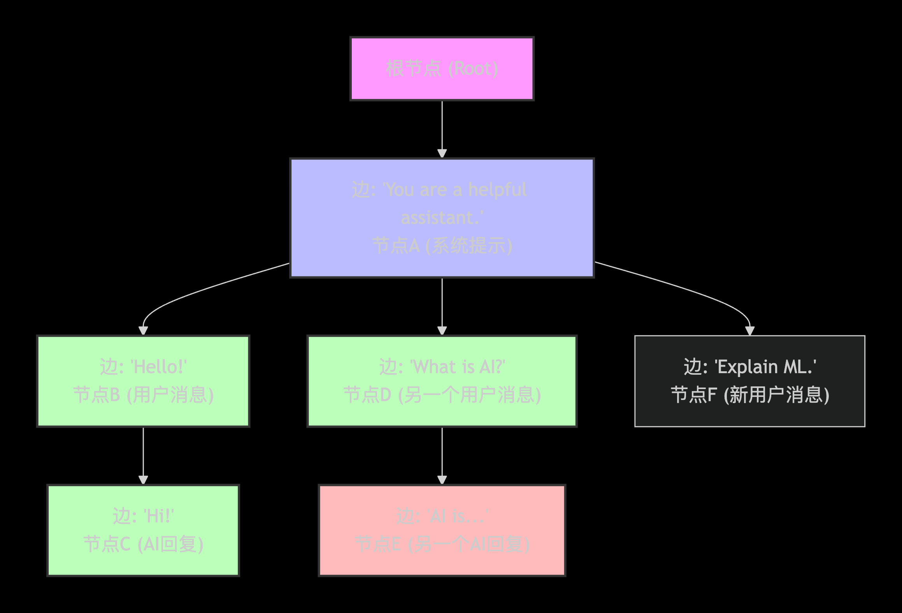

# vLLM

+++

## KV cache 存在的显存占用问题：

在大模型推理时，按照可生成最长序列长度分配显存，利用率只有20%~40%，造成三种类型的浪费：

1. 预分配，但不会用到。（预分配了最长序列下的KVcache，但是实际上可能提前输出了终止符）
2. 预分配，但尚未用到。（显存会根据最长序列长度提前分配好KVcache，但是在生成前面token时后面的cache都没用到，但显存已经分配占用）
3. 显存之间的间隔碎片，不足以预分配给下一个文本生成。（虽然最大生成长度一致，但是prompt不同，每次预分配的KVcache也不同，因此在一个请求生成完毕释放缓存后，下一个较小的prompt的KVcache无法放入被释放的缓存中）

LLM推理速度有两个指标，分别是时延和吞吐。 

* 所谓时延，就是单条请求从发出到完成计算的时间，这个vLLM确实没有明显提高。
*  但是对于吞吐，是说服务器单位时间内完成了多少条请求的计算，因为优化了显存，可以增加单位时间内处理的请求数，所以吞吐会大幅增加

## Page Attention

### 优势：

* 按需分配，不提前分配
* 用Block来分配，减少了碎片大小
* 虚拟内存，方便实现调用

### 原理：

* 借鉴了操作系统中的虚拟内存和页管理技术：page作为分配内存的最小单元（4Kb），使用的进程分配不同的page

  

* page attention 将显存划分为不同的KV Block来管理KV Cache，llm每个请求需要的KV Cache被划分到不同的KV Block（每个Block中可以缓存的token的KV Cache数量是固定的， 一个token序列分配到的KV Block在物理显存中可以是不连续的）

  

* 对于后续生成的token的KV，会被继续加载到未被填满的Block中

* 对于每一个request，都有一个逻辑KV Cache（显存是连续的），然后vLLM维护一个**映射表**到物理显存的KV Cache

  

* Sharing KV Blocks：对于同一个prompt，希望生成n个Output。

  在物理显存KV Cache中，会标注每一个Block被逻辑内存中Block引用的次数，当引用数=0时，Block被占用的显存被释放。

  Copy on Write机制：当开始生成时，发现继续写入的Block的引用数为n时，触发机制。拷贝写入的Block到一个新的Block，然后各自开始生成，但是prompt起始部分的KV Block是共享的。

* 优化Beam Search中的显存占用，因为有共用token

+++

# SGLang

> **Radix Attention (基数树注意力)**：这是SGLang对标PagedAttention的核心创新。它采用**基数树（Radix Tree）**的数据结构来管理KV缓存，能够高效地**自动检测和复用**请求之间共享的公共前缀。在多轮对话、RAG检索等场景中，这可以**避免重复计算历史对话或固定提示词（Prompt）的KV缓存**，极大地减少了预填充的计算量，从而显著降低延迟并提升吞吐量。在某些场景下，实际吞吐量可超越vLLM 2-5倍。

## 待解决的 KV Cache 问题

在传统的Transformer推理中，每个新请求（即使和之前的请求有大量重复的对话历史）都需要从头开始计算所有Token的KV缓存，这导致了大量冗余的**预填充计算**（**Prefill**），严重拉长了首Token的延迟

## Radix Attention 核心原理

它的核心是一个精心设计的动态数据结构和工作流程。

#### 🌳 1. 数据结构：基数树

RadixAttention使用**基数树**来管理KV缓存。与普通的前缀树（每个节点只存一个字符）不同，基数树的节点可以存储**一段连续的Token序列**（一个“子串”），这使得它非常节省空间和高效。

在这个树中：

- **共享路径**：两个不同的对话会话都从根节点出发，共享了`系统提示`路径（节点A）的KV缓存，避免了重复计算。
- **分支路径**：在共享路径之后，树分出不同的分支（如节点B、D、F），代表不同会话的私有上下文。

#### 🔄 2. 动态工作流程

RadixAttention在服务请求时，会动态地维护这棵树，主要包括以下几个步骤：

1. **前缀匹配**：当一个新请求（如第二个会话的"Explain ML."）到达时，系统会从树的根节点开始，沿着Token序列在基数树中查找**最长可匹配的路径**（即已缓存的KV缓存）。匹配到的部分可以直接复用，无需计算。
2. **节点分裂**：如果新请求的前缀只匹配了某个现有节点的一部分，该节点会被**动态分裂**。例如，一个存有"Hello!Hi!"的节点，如果另一个请求只共享"Hello!"，这个节点就会分裂成共享的"Hello!"和私有的"Hi!"两部分。
3. **节点插入与扩展**：对于未匹配到的新Token序列，系统会创建新的节点并插入到树中，作为现有节点的分支。如果是在现有对话基础上继续，则在对应的叶子节点后扩展出新节点。

#### 💾 3. 智能内存管理

为了在有限的GPU显存中高效运作，RadixAttention还集成了智能的内存管理策略：

- **引用计数**：每个节点都有一个计数器，记录当前有多少正在运行的请求正在使用它。正在被使用的节点**不会被驱逐**。
- **LRU（Least Recently used）驱逐策略**：当显存不足需要腾出空间时，系统会优先驱逐那些**最近最少使用**且引用计数为0的**叶子节点**。这种策略能最大程度地保留可能被复用的共享祖先节点。
