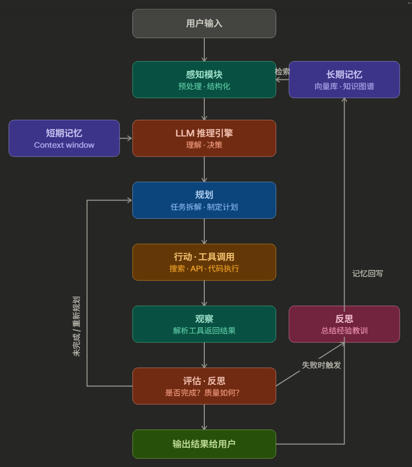
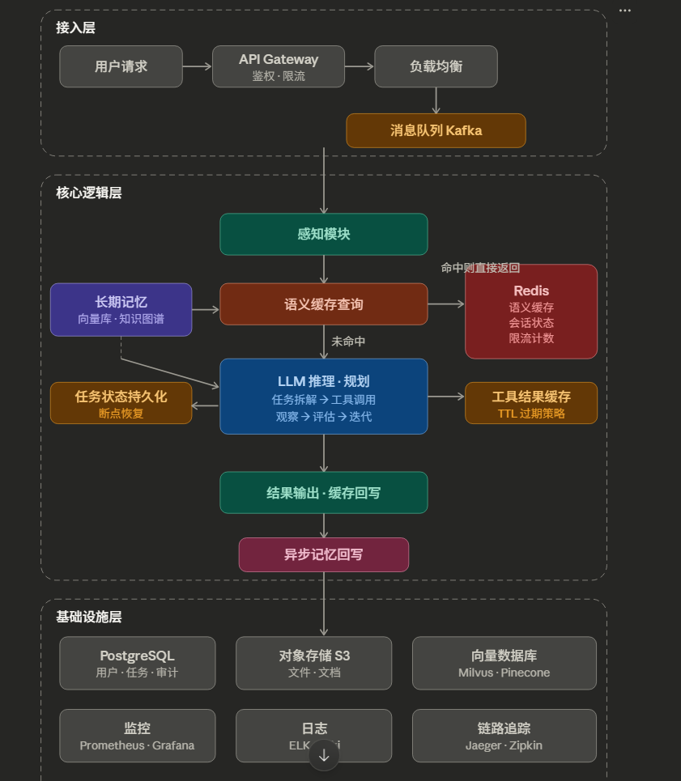
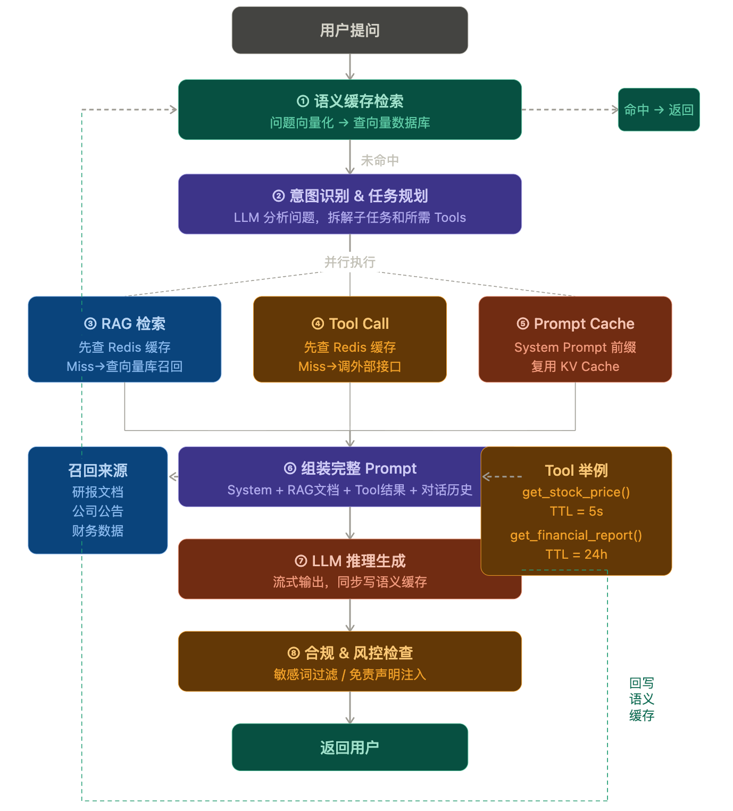

# Agent

+++

1. 你如何定义一个基于 LLM 的智能体（Agent）？它通常由哪些核心组件构成？

   * Agent 是一个以 **LLM 作为推理核心，能够感知环节、制定计划、记忆检索、调用工具的自主决策系统**。
     * LLM：推理核心。接受感知模块，参考记忆，与工具交互。常用ReAct范式驱动
     * 感知模块perception：处理多模态的输入（文本、图像、音频、结构化数据包括API返回的JSON和工具调用结果）
     * 记忆模块Memory：短期记忆、长期记忆
     * 工具调用Tool use：网络搜索、执行 Python 代码、调用外部 API、读写文件、操控浏览器等。LLM 通过生成结构化的 function call 来触发工具

2. 请详细解释 ReAct 框架。它是如何将思维链和行动结合起来，以完成复杂任务的？

   * ReAct：Thought → Action → Observation。让 LLM 在每一步都先"思考"再"行动"，并将行动结果作为新的观察融入下一轮推理
   * 思维链只推理不行动，知识静态、无法验证推理是否正确、容易幻觉。

   + 标准 CoT 的推理链完全在 LLM 内部，靠参数记忆支撑，一旦超出训练知识就会出错。ReAct 在每个 Thought 之后插入一个 Action→Observation 环节，用真实世界的信息校正推理链，让 Thought 始终有事实依据。

   

3. 在 Agent 的设计中，“规划能力”至关重要。请谈谈目前有哪些主流方法可以赋予 LLM 规划能力？（CoT、ToT、GoT 、Plan-and-Excute、ReAct、Reflexion、Multi-agent）

   难点：对于任务拆解的合理性

   1. CoT让模型不直接生成答案，而是通过问题-推理链-答案，展开中间推理过程。有两种触发方式：Few-shot结合zero-shot

      1. ToT 是对 CoT 的重大扩展：把单条推理链变成一棵**搜索树**，在每个节点都探索多个可能的下一步，并用**评估函数**剪枝。

         ToT 的核心组件有四个：**思维生成器**（产生 k 个候选下一步）、**评估器**（给每个节点打分，可用 LLM 自评或外部启发式）、**搜索算法**（BFS 广度优先或 DFS 深度优先）、**剪枝策略**（丢弃低分节点）。适合解数学题、24点游戏、创意写作等需要回溯的任务，但调用 LLM 次数多，成本高。

         ToT 的思维只能父→子单向流动，GoT 打破了这一限制，允许节点**任意合并、聚合、形成环**，更接近人类真实的思考结构。

      2. GoT 引入了三类核心操作：**分解**（将大任务拆为并行子任务）、**聚合**（将多路思维合并为一个更好的结论）、**精炼**（对节点自我修正，形成有向环）。适合文档排序、集合运算等可并行化的任务，效率显著高于 ToT。

   2. ReAct：

   3. Plan-and-excute：这个模式把**规划和执行显式分离**成两个阶段。先由一个 Planner 制定完整计划，再由一个 Executor 逐步执行。适合多步骤、可分解的复杂任务

   4. Reflextion：Reflexion 的核心是引入**自我反思**机制。Agent 在完成一次尝试后，不是直接输出结果，而是先自我评估。它特别适合**允许多次尝试**的场景，比如代码生成（写完跑测试，不通过就反思修改）。局限性在于它依赖多轮迭代，成本更高

   一个成熟的 Agent 系统完全可以用 Plan-and-Execute 做全局规划，每个子任务内部用 ReAct 循环执行，失败后用 Reflexion 机制反思改进。

   

4. 感知模块：理解环境反馈（包括文本、图像、音频、带有JSON格式的工具返回等），难点在于如何处理多模态的信息对齐

   * 负责**接收、解析和理解来自环境的各种信息**，然后将其转化为 LLM 能够处理的结构化输入
     * 信息采集：用户输入（文本、上传的文件）、工具执行返回结果、多模态的输入
     * 信息预处理：文本清洗（工具返回的结果比如网页、广告需要进行数据清洗）；格式转换、信息提取（PDF-文本、音频-文字ASR）
     * 内容压缩

5. Memory是 Agent 的一个关键模块。请问如何为 Agent 设计短期记忆和长期记忆系统？可以借助哪些外部工具或技术？

   难点是记忆检索效率的提升和记忆遗忘策略

   短期记忆 Short-term Memory：对应 Agent **当前会话/任务**中的信息存储，本质上是对 LLM **Context Window** 的管理，包括对话历史、任务目标、已执行步骤和中间结果、工具调用返回值等

   * 滑动窗口。保留最近N轮对话，丢弃更早的历史。长度控制，但是丢失早期关键信息
   * 对话摘要压缩：定期对历史对话压缩成摘要，保留摘要+近N轮对话。摘要过程本身可能丢失细节
   * 关键信息提取：从历史中提取结构化的关键事实，以更紧凑的形式保留在上下文中

   长期记忆 Long-term Memory：长期记忆对应 Agent **跨会话、跨任务**的**知识积累**，必须借助**外部存储**实现持久化。 通过RAG 按需取回

   * 语义记忆——存储的是通用的、去语境化的事实和概念。通常对应知识库、知识图谱或经过提炼的用户画像
   * 情节记忆——存储的是具体的、带有时间和情境信息的交互片段。技术实现上通常是将完整的交互片段做 embedding 后存入向量数据库，检索时按语义相似度召回相关的历史经验
   * 程序记忆——对应的是 Agent 的行为策略、能力。一般固化进 System prompt，通过FT让模型权重学会（工具）
   * 核心技术栈：
     * **向量数据库**是最常见的长期记忆载体，比如 Pinecone、Milvus、Chroma、Weaviate。将历史信息 embedding 后存储，查询时通过语义相似度检索最相关的记忆片段注入到 context 中。
     * **传统数据库**（关系型或 KV 存储）适合存储结构化的事实信息，比如用户画像、配置项、任务历史记录，优势是精确查询，不存在向量检索的模糊性问题。
     * **知识图谱**适合存储实体之间的关系，比如"张三是 A 项目的负责人"、"A 项目依赖 B 服务"。在需要多跳推理的场景下，图谱比向量检索更有优势。

   

6. Tool Use是扩展 Agent 能力的有效途径。请解释 LLM 是如何学会调用外部 API 或工具的？（可以从 Function Calling 的角度解释）

   **LLM 的本质是文本输入、文本输出。**

   **tool use本质是让 LLM 输出结构化的"意图描述"，**由外部系统解析并真正执行，再把结果还给 LLM

   * SFT：通过专门构造的训练数据学会的。训练数据包含：返回工具调用的格式、根据工具调用结果继续生成
   * RL：通过强化学习奖励"正确调用工具并给出好回答"的行为，惩罚"乱调工具"或"参数填错"的行为，提升工具调用的准确性

   Function的完整流程：

   * 开发者定义工具，用 json scheme 描述工具的名称、功能、参数

   * 工具描述注入prompt

   * 模型决策——调用 / 不调用：输出结构化的 tool call，模型停止生成

   * 外部系统执行工具

   * 结果回注，模型继续生成：工具执行结果作为新的消息追加到对话历史，模型基于结果生成回复

     

7. 请比较一下两个流行的 Agent 开发框架，如 LangChain 和 LlamaIndex。它们的核心应用场景有何不同？

8. Agent 普通工作链路：

   1. **用户输入与感知处理**：用户发出请求，感知模块做预处理（格式转换、信息提取、摘要压缩），转换为结构化的输入

   2. **记忆检索**：LLM 开始推理之前，系统会根据当前任务从长期记忆（向量数据库、知识图谱等）中检索相关的历史经验和背景知识，注入到当前的上下文中，作为推理的参考依据。

   3. **规划**：LLM 根据任务目标和已有上下文，制定执行计划。简单任务可能直接生成行动指令（ReAct 模式），复杂任务则先拆解为多个子任务（Plan-and-Execute 模式）。

   4. **行动执行**：Agent 调用工具，与外部环境交互

   5. **观察与评估**：工具返回的结果重新进入感知模块处理，然后 LLM 评估当前进展：任务是否完成？结果是否符合预期？是否需要调整计划？

   6. **迭代或终止**：任务完成则整理最终结果输出给用户 /  如果任务未完成，回到规划或行动阶段继续循环 / 如果评估发现执行出了问题，可能触发反思机制（Reflexion），总结经验后重新尝试

   7. **记忆回写**： 任务结束后，将有价值的信息（关键事实、用户偏好、成功经验）写入长期记忆，供未来任务使用

      

9. 真是生产环境下的 Agent 完整工作链路

   1. **接入层**（Access Layer）

      接入层核心职责是**安全地接收请求、保护后端服务、并将请求可靠地传递到核心逻辑层**

      * 用户请求首先经过 **API 网关**：主要负责认证**鉴权**、**限流**、**熔断与降级**，这一层主要是保护后端服务不被异常流量击穿

        > 认证鉴权（Authentication & Authorization） 验证请求方的身份，对于多租户的 Agent 平台，还需要在这一层做租户隔离，确保用户 A 的请求不会访问到用户 B 的数据和记忆
        >
        > 流量控制（Rate Limiting）。这在 Agent 系统中尤为关键，因为每次请求背后可能触发多次 LLM 调用，成本远高于普通 API。常见的策略是多级限流——全局限流保护系统总容量，用户级限流防止单个用户耗尽资源，以及基于 Token 消耗量的限流。
        >
        > 熔断与降级（Circuit Breaking）。当下游的 LLM 服务或工具服务出现故障时，网关需要快速熔断，避免请求堆积导致级联故障。降级策略可以是返回缓存的历史结果、切换到备用模型（比如从 GPT-4 降级到 GPT-3.5），或者直接返回预设的兜底回复。

      * 请求通过网关后，经过**负载均衡**，将**请求分发到具体的 Agent 服务实例**（简单的轮询（Round Robin）策略并不理想，更适合用加权最少连接数（Weighted Least Connections）策略，把新请求分配给当前负载最轻的实例）

      * 根据任务的**预期执行时间**，**请求被分流到同步或者异步**。同步路径适合简单快速的请求；如果是长时间运行的复杂任务，通常走异步模式，请求先投递到**消息队列**（Kafka、Redis streams），后端 Worker **异步消费执行**，用户侧通过 **WebSocket 或者 轮询 获取进度**

   2. **核心逻辑层**（Core Logic Layer）

      请求从接入层进来后，首先经过感知模块

      * 感知与预处理：**感知模块做预处理（格式转换、信息提取、摘要压缩），转换为结构化的输入**（感知模块通常不是一个单体服务，而是一组微服务的协作。 比如文件解析服务（处理 PDF、Word、图片）、ASR 服务（语音转文字）、OCR 服务（图像文字识别）各自独立部署，感知模块作为编排者调用它们，汇总结果后输出结构化的上下文）
      * **感知模块输出结构化输入后，在进入 LLM 之前，系统会做缓存查询**。精确缓存对输入做哈希然后查找有无完全相同的历史请求；语义缓存，对输入做 embedding，在向量索引中查找语义相似度高于设定阈值的历史请求
      * **上下文组装成一个完整的 prompt**：system prompt（角色定义、能力边界和行为规范）、长期记忆检索（从向量数据库中召回的与当前任务相关的历史经验、用户偏好、领域知识）、短期记忆（当前会话的对话历史和中间状态，从 Redis 中加载）、候选工具。每个部分设定一个软上限，超量时按照优先级截断 / 压缩
      * **LLM 推理和编排**：Model Router 动态地根据任务复杂度选择模型。**推理循环**就是 ReAct、Plan-and-Execute 等模式的具体实现。同时要设置最大迭代次数，防止Agent进入死循环
      * **工具执行层**：也会做一次Redis缓存检索，同时工具执行层面需要处理：**超时与重试**（每个工具调用都有超时限制，超时后自动重试或回退到备用方案。不同工具的超时阈值不同）；**沙箱隔离**（代码执行类工具必须在沙箱环境中运行如Docker，防止恶意代码影响宿主系统）；**结果校验**（对工具返回结果进行校验和清洗，防止出现prompt injection，需要做安全过滤）；**工具结果缓存**：对时效性不敏感的调用结果，缓存到 Redis 中避免重复请求
      * **评估与反思**：更加成熟一点的系统中，会引入一个独立的模型或者启发式规则对agent的输出做质量检查、安全检查，如果发现了错误就出发 Reflexion 反思机制，将是失败错误原因分析并追加到下一轮循环的上下文中。
      * 结果输出与记忆回写：任务完成后，最终结果经过格式化返回给用户。同时触发异步的记忆回写流程：将本次交互中产生的有价值信息（新的事实、用户偏好、成功的执行策略）写入长期记忆。这个回写通常是异步的——先投递到消息队列，由独立的 indexing 服务做 embedding 并写入向量数据库，不阻塞用户的响应。

   3. **基础设施层**：

      * Redis 和 消息队列
      * 关系型数据库（PostgreSQL/MySQL）：存储用户配置、任务记录、审计日志
      * 对象存储（S3/MinIO）：存储用户上传的文件和文档
      * 可观测性组件（Prometheus + Grafana 做监控，ELK 或 Loki 做日志，Jaeger/Zipkin 做分布式链路追踪）

      

10. Redis 缓存作用：

    1. **语义缓存：**这对高频重复问题（比如客服场景）能大幅降低延迟和成本。实现上可以用 Redis 的向量搜索能力（Redis Stack 的 `RediSearch` 模块），或者用独立的向量库配合 Redis 做结果缓存。
    2. **对话状态管理：**短期记忆存储在 Redis 中，而不是仅仅放在内存里，这样做的好处是：服务实例可以无状态化，任意一个 Worker 拿到任务后都能从 Redis 恢复完整上下文
    3. **工具调用结果缓存**。很多工具调用的结果在短期内不会变化——比如天气 API、汇率查询，把这些结果缓存在 Redis 中并设置合理的 TTL，可以避免重复调用外部服务，降低延迟和费用
    4. **速率限制**保护 LLM API 不被超额调用。用 Redis 的 `INCR` + `EXPIRE` 或者 Lua 脚本实现滑动窗口计数

11. 在构建一个复杂的 Agent 时，你认为最主要的挑战是什么？

    * **任务的规划与分解的可靠性**：这是最根本的挑战。**LLM 在短任务上表现不错，但面对需要十几步甚至几十步的复杂任务时，会出现规划跑偏、中间推理步骤出错导致结果完全偏离**。这也是为什么 Plan-and-Execute、ReAct等框架被提出——本质上都是在试图让 Agent 的规划更稳定可控。
    * 工具调用的准确性和鲁棒性（工具选择错误、参数幻觉、调用失败处理错误信息、工具数量瓶颈）
    * 感知模块：多模态的输入的对齐
    * 记忆和状态管理：Agent 运行过程中需要维护大量状态
    * 安全控制

    构建复杂 Agent 最大的挑战不是单点能力，而是**如何在长链路、真实环境、不可预测输入下保持整体可靠性**；

12. 什么是编排器

    编排器（Orchestrator）是 Agent 系统的**总调度中心**，负责控制整个"感知 → 规划 → 推理 → 行动 → 观察 → 评估"循环的执行流程。

    * 输出解析与路由：编排器需要判断输出的真实意图，是工具调用请求还是文本回复，如果工具格式解析失败还要有容错机制（自动修复格式、参数校验与修正）
    * 工具调度（调用前进行安全检查：权限是否允许、参数是否在白名单内；工具返回结果是否需要脱敏）
    * 状态管理（编排器维护整个任务执行过程中的所有状态：当前历史对话、任务执行进度、累计资源消耗）

13. Agent 评估为什么比普通 QA 难

    Agent 评估本质上是：结果、过程、成本效率、稳定性

    结果是否正确、任务规划是否合理、工具调用是否正确、成本可接受、行为稳定是否可复现

14. Agent 评估指标有哪些

    1. 任务层面：

       * 任务成功率（Success Rate）/ Pass@k（代码和搜索场景）
       * 回答质量：事实准确性、相关性、完整性
       * 过程方面：工具调用准确率 / 参数匹配率 / 错误恢复能力

    2. 系统层面：

       * 端到端延迟（End-to-End Latency）、TTFT、QPS、TPS
       * 平均 token 消耗、平均工具调用次数、推理循环次数

    3. 安全层面：

       * Hallucination Rate
       * 指令遵循度（Instruction Following）
       * 安全边界（Safety Boundary）：包括 prompt injection 的防御能力、敏感信息泄露防护

       

15. 对于在真实场景下(金融对话问答)的高并发 Agent 的**缓存优化**

    缓存场景的特殊性：数据实效性强、查询高度重复（System Prompt、RAG 检索结果、工具调用结果）、准确性要求极高、高并发（同一时段大量用户问相似问题（如"今天沪深300涨了多少？"）

    多层缓存架构：缓存优化的本质是**识别请求的可复用边界**

    * **Prompt Cache（LLM 侧）**：vLLM、SGLang等推理引擎都有前缀缓存复用；Anthropic、OpenAI 都支持 Prompt Caching

      金融 Agent 的 System Prompt 往往很长（工具描述、风控规则、合规说明）

      缓存后节省 prefill 时间和费用

    * **Semantic Cache（语义缓存）**：

      对用户问题做 Embedding，查询向量数据库（如 Redis + FAISS / Qdrant），若与历史问答的**余弦相似度 > 阈值**（如 0.92），直接返回缓存答案

      **关键点**：

      - 阈值要根据金融场景调高，避免"利率上升"和"利率下降"被误判为相似
      - 缓存 key 可加上**时间窗口**（金融数据时效性强，行情类问题缓存 TTL 设 1 分钟）

    * **Tool Call 结果缓存（行情/数据接口）**：

      Agent 调用行情接口、财务数据接口的结果缓存

      按工具类型差异化 TTL：

      | 工具         | TTL     |
      | ------------ | ------- |
      | 实时股价     | 3~5 秒  |
      | 日 K 数据    | 1 小时  |
      | 财报数据     | 24 小时 |
      | 公司基本信息 | 7 天    |

    * **RAG 检索结果缓存（行情数据、知识库）**：在Redis中储存的是 key：之前的查询query，value：chunk

      对知识库、大型文档中进行RAG检索返回的时效性不敏感的结果也对检索 query 做缓存，相同问题不重复召回向量库

      金融研报、公告等**低频更新**的内容，缓存 TTL 可设较长（数小时）

      **注意**：需要有缓存失效机制，如新公告发布时主动 invalidate

      

16. 如何让 agent 稳定的输出 JSON

17. 基本概念

    | 概念            | 全称                    | 含义                             |
    | --------------- | ----------------------- | -------------------------------- |
    | **TTL**         | Time To Live            | 缓存过期时间                     |
    | **TTFT**        | Time To First Token     | 首 Token 延迟                    |
    | **TPS**         | Tokens Per Second       | 每秒生成 Token 数，衡量生成速度  |
    | **E2E Latency** | End-to-End Latency      | 从发请求到收到完整回复的总时间   |
    | **QPS**         | Queries Per Second      | 每秒处理请求数，衡量并发能力     |
    | **P99 Latency** | 99th Percentile Latency | 99% 请求的延迟上限，衡量尾部性能 |

    Redis特点：数据存放在内存中；数据结构是 Key-Value；天生支持 TTL数据自动过期（EX）；

    

18. 真实场景下 Agent 的工作链路（高并发系统设计）

    

    ​	用户提问Query：

    1. **语义缓存检索**：把问题 embedding 成向量，去向量数据库里计算相似度。如果相似度超过阈值（比如 0.92），且缓存还没过期，直接返回历史答案。流程结束

    2. **任务分析与规划：**这个 Query 需要哪些信息？要调哪些工具？任务之间有没有依赖关系？

       对不同的子任务并行执行：比如网页查询工具、RAG检索工具等等

    3. 并行执行：使用RAG/Tool缓存的话就能跳过外部IO，提升TTFT

       1. RAG 检索：先查 Redis 有无这个查询的缓存 → 有就直接用；没有才去向量库召回chunk
       2. Tool Call：工具调用前先查 Redis → 命中就用缓存结果；不命中才真正请求外部接口，并按 TTL 存回 Redis

    4. 组装完整的 Prompt：

       System（角色定位、规则）+ 历史对话（使用KV Cache 的前缀复用）+ RAG 召回的文档 chunk + Tool 结果 + Query

    5. LLM 推理生成，同步写入语义缓存

    6. 合规、风控检查：对一些敏感词进行过滤、免责声明注入

       

19. 高并发情况下的一些具体优化策略

    1. **缓存击穿（Cache stampede）**：当热点key过期瞬间，大量相关的 request 瞬间发送到LLM，导致系统过载

       解决方法：用 Redis `SETNX` 实现**分布式锁**，第一个拿到锁的请求能够去调用 LLM，其余请求等待。LLM 返回后写入缓存，释放锁，所有等待请求直接读缓存。还可加随机 TTL 抖动（±10%），防止大批 key 在同一时刻集中过期。

    2. **请求合并**：设定一个时间窗口（100ms），同一时间窗口内发送的相同请求合并加入消息队列，只调用一次LLM，将结果广播给所有相同的请求

    3. **多级缓存**：

       **L1（本地内存）** 对应第一级，部署在应用进程内，速度最快（<1ms），但容量有限（约1000条），用于拦截**极热**数据。

       **L2（Redis）** 对应第二级，是分布式共享缓存，速度较快（3~5ms），容量大，作为 L1 的后备与跨节点共享层。

    4. **异步预热**：统计日志中每日的Top问题，提前预生成答案写入缓存，避免高峰期系统压力过大

    

20. Agent系统中 KV Cache 的管理（生命周期）

    1. Prefill：System prompt+ 用户 Query。Agent 每轮工具调用或者RAG检索结果都会被记录为历史对话并且塞进下一轮的上下文
    2. 复用：System prompt + 历史对话 + 新Query。只要对新增部分计算KV并并缓存，之前轮次中的prompt KV cache已经被缓存了
    3. 缓存释放（驱逐、Eviction）：显存不够时，KV Cache 不能无限增长，推理引擎按策略清掉最不重要的 Block。
       1. LRU（最近最少使用）：最久没被访问的 Block 先驱逐。vLLM 默认策略
       2. 前缀保护（Prefix-Aware）：System Prompt 的 KV Block 永不驱逐，优先保留共享前缀，降低所有请求的 prefill 开销
       3. 滑动窗口截断：对话超过 N 轮时，保留头部（System Prompt）+ 尾部（最近几轮），中间压缩或丢弃

21. **Agent skill** 了解一下，与MCP、tool对区别

    1. **Tool**：Agent 能力的最小粒度，是 LLM 可以直接调用的函数，在代码里是写死定义与实现的。LLM 在 system prompt 中看到 tool 定义，在推理的过程中决定是否调用，在本地执行代码并返回结果。本质是单次的函数调用
    2. **MCP**：标准化的工具调用协议。tool 在每一个 Agent 都需要实现一遍接口对接，MCP就是把 tool进行封装，LLM 只需要输出标准输出，就能得到返回结果。
    3. **Skill**：是一个能力描述文本，以 system prompt 形式存在，被写入一个.md 文件中，描述了 Agent 能力的描述，真正执行的还是 Tool 或者 MCP

22. Multi-agent是什么

    * 核心概念：Multi-agent 系统是指**多个 AI 智能体协作完成任务**的架构。单个 Agent（智能体）本质上是"LLM + 工具调用 + 记忆"的组合，能够感知环境、自主规划、执行动作。而当多个 Agent 协同工作时，就形成了 Multi-agent 系统。
    * 三种经典架构：
      1. 层级式（orchestrator + worker）：一个**编排 Agent **负责分解任务、分配工作，多个"**sub-Agent**"执行。如果任务更复杂，还可以设置多层的嵌套，sub-agent下再设置agent
         * Orchestrator（编排者）是整个系统的大脑。它接收用户请求，将复杂任务分解成若干子任务，分配给合适的 Sub-agent，最后收集结果并整合输出。
         * Sub-agent（子智能体）各自专注于自己的领域——比如信息检索、代码执行、外部服务调用。它们可以使用工具（搜索、数据库、API 等），也可以再调度更下层的智能体，形成层级结构。
      2. 流水线式（Pipeline）：Agent A 的输出是 Agent B 的输入，形成链条。如代码开发流程：研究 Agent → 设计 Agent → 编码 Agent → 测试 Agent
      3. 去中心化协作式：多个 Agent 平等地共享信息、相互通信

23. Agent 上线后如何做可观测性（Observability）

    关键是在每个环节做好 Tracing。需要记录的信息包括：每次 LLM 调用的输入输出和 token 消耗、工具调用的参数和返回值、检索结果和相关性分数、整体链路的耗时。常用的工具有 LangSmith、Phoenix (Arize)、Langfuse 等。此外还要设置告警（如延迟过高、错误率突增、token 消耗异常），以便快速发现问题。

24. Agent 系统如何做安全防护？常见的风险有哪些？

    * Prompt Injection：攻击者通过精心构造的输入，试图覆盖或绕过 Agent 的 system prompt 中定义的行为规则。
    * 工具滥用与越权（Agent 诱导 Agent 调用删除接口清空数据库、在沙箱执行恶意代码等）
    * 数据泄露（Agent 在运行过程中接触大量敏感信息：用户的对话历史、长期记忆中的个人偏好、检索到的内部文档、工具返回的业务数据。）攻击者通过 prompt injection 诱导 Agent 输出 system prompt 或内部知识库的内容、或者 Agent 在调用外部工具时把敏感信息作为参数传出去了
    * 拒绝服务：攻击者可以构造需要大量推理循环的恶意任务，让 Agent 陷入长时间的工具调用循环，耗尽 LLM API 配额和计算资源

    防护措施包括：

    * 输入层防护：
      * 对用户输入做过滤和检测、多租户隔离
    * 工具层防护
      * 对工具调用设置最小权限、操作确认机制、沙箱执行、速率限制与预算控制
    * 输出层防护：
      * 使用 Guardrails  在 Agent 的输出返回给用户之前，经过一层安全检查（敏感信息、有害）
    * 数据层防护：
      * 限制 Agent 的最大执行步数防止无限循环。
      * 敏感信息脱敏
      * 多租户隔离

25. 将一个 Agent 从原型推向生产环境需要考虑哪些关键问题？

    * 可靠性（添加重试机制、fallback 策略、超时控制）；
    * 可观测性（完整的日志和 tracing）；
    * 评估体系（建立测试集，持续回归测试，避免改一个坏一片）；
    * 安全性（输入输出过滤、权限控制）；
    * 成本管理（token 预算、缓存、模型选择）；
    * 用户体验（流式输出、合理的等待提示、失败时的友好降级）；
    * 扩展性（是否需要队列化、是否需要异步执行、并发如何处理）。

# RAG

+++

1. 请解释 RAG 的工作原理。与直接对 LLM 进行微调相比，RAG 主要解决了什么问题？有哪些优势？

2. 一个完整的 RAG 流水线包含哪些关键步骤？请从数据准备到最终生成，详细描述整个过程。

3. 在构建知识库时，文本切块策略至关重要。你会如何选择合适的切块大小和重叠长度？这背后有什么权衡？

4. 如何选择一个合适的嵌入模型？评估一个 Embedding 模型的好坏有哪些指标？

5. 你还知道哪些可以提升 RAG 检索质量的技术 / 检索效果不好时候，如何优化？

   1. query 优化方面：可以做 Query Rewriting（改写用户问题）、HyDE（用 LLM 先生成假设性答案再用它检索）、Multi-query（将问题拆成多个子问题分别检索）。
   2. **检索优化方面**：可以用混合检索（向量检索 + 关键词检索）进行粗召回，再用 Reranking（用交叉编码器对初步结果重排序）进行精准召回。
   3. **索引优化方面**：可以调整分块策略、增加元数据过滤、构建层次化索引等。

6. 请解释“Lost in the Middle”问题。它描述了 RAG 中的什么现象？有什么方法可以缓解这个问题？

7. 如何全面地评估一个 RAG 系统的性能？请分别从检索和生成两个阶段提出评估指标。

   1. 检索阶段：Recall@K（前 K 个结果中包含正确答案的比例）、MRR（正确答案排名的倒数均值）；
   2. 生成阶段：Faithfulness（回答是否忠于检索到的上下文，有没有幻觉）、Answer Relevancy（回答与问题的相关度）

   常用的评估框架有 **RAGAS** 和 **TruLens**，它们可以自动化地评估这些维度。

8. 在什么场景下，你会选择使用图数据库或知识图谱来增强或替代传统的向量数据库检索？

9. 传统的 RAG 流程是“先检索后生成”，你是否了解一些更复杂的 RAG 范式，比如在生成过程中进行多次检索或自适应检索？

10. RAG 系统在实际部署中可能面临哪些挑战？

11. 了解搜索系统吗？和RAG有什么区别？

12. 知道或者使用过哪些开源RAG框架比如Ragflow？如何选择合适场景？

13. graph RAG 是什么

