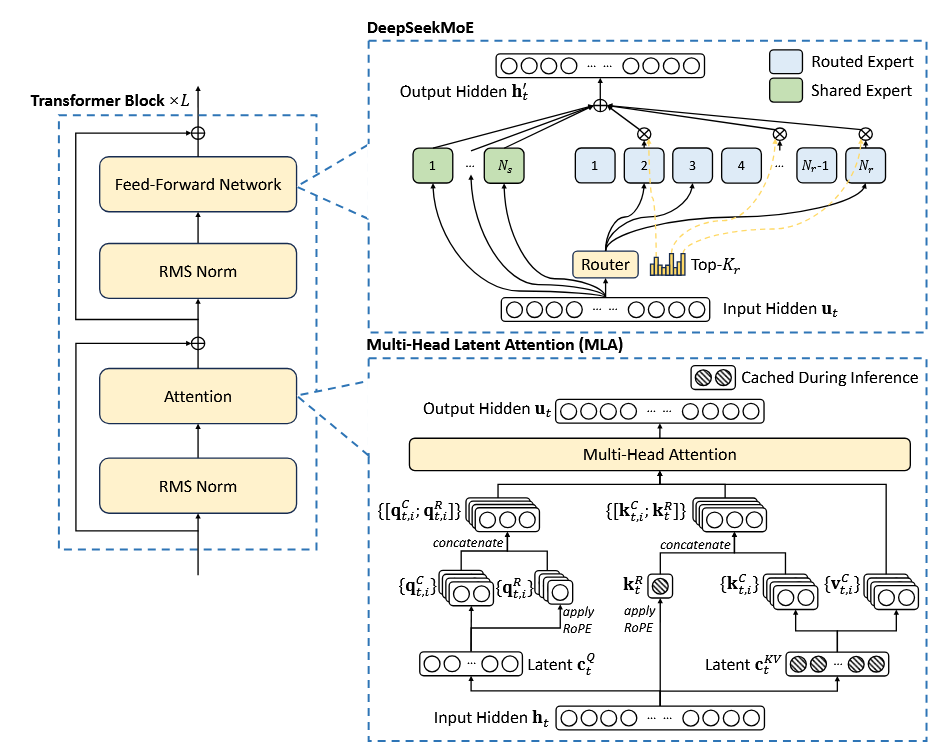
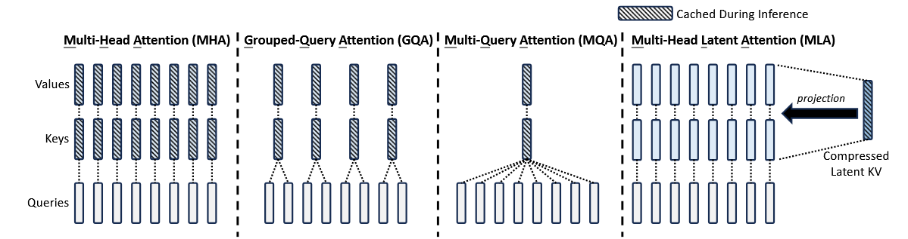
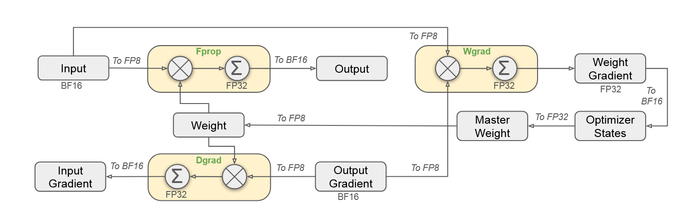
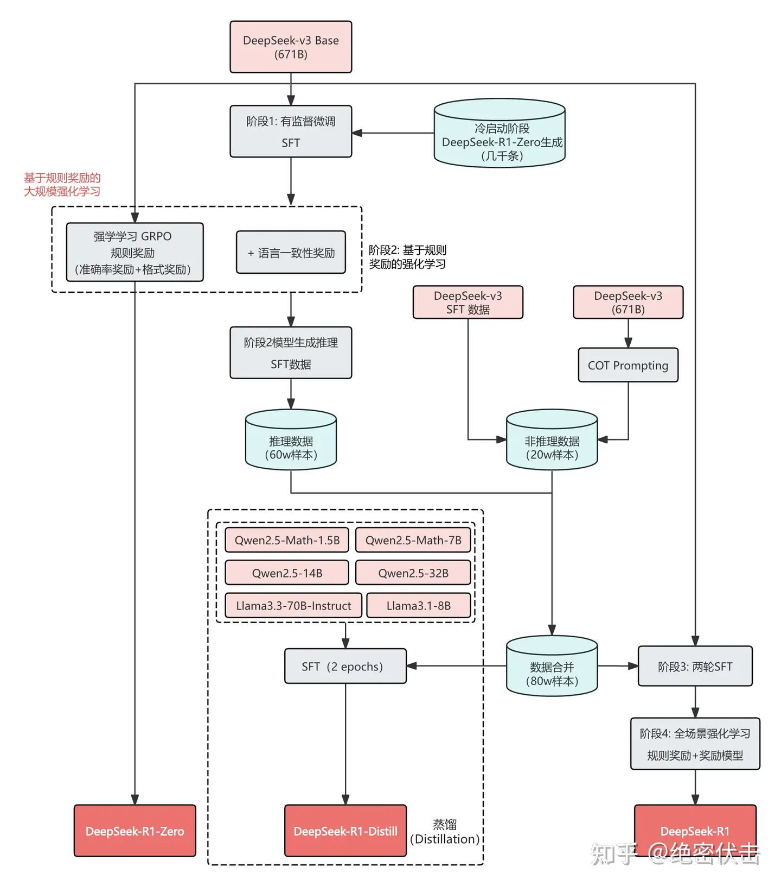
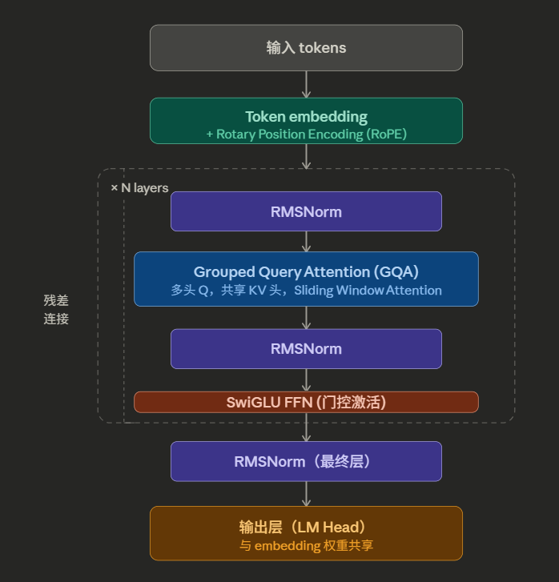

> DeepSeek历程

# DeepSeekMath-7B

+++

在Coder-base 模型上继续预训练，使用的都是数学相关token，目的是强化数学推理能力。提出了GRPO，奖励模型采用过程奖励模型（PRM）方法

# DeepSeek-V2 技术报告

+++

## 技术特点：

* 提出了MLA（多头潜在注意力） 和 DeepSeekMoE（V3中介绍）

* MLA 的出发点是：KV Cache 存的是高维向量，但这些向量所在的流形其实是低维的，可以先压缩再存，用时再解压。具体做法是，不直接缓存 K 和 V，而是缓存一个**低维的潜在向量**（latent vector）** $c^{KV} $
  $$
  c^{KV} = W^{DKV} \cdot h
  $$
  其中 $W^{DKV} $ 是一个**降维投影矩阵**，$h $ 是该 token 的隐藏状态。$c^{KV} $ 的维度远小于原始 KV 的维度。推理时，需要用 K 和 V 时再通过**升维矩阵** $W^{UK} $、$W^{UV} $ 还原：
  $$
  K = W^{UK} \cdot c^{KV}, \quad V = W^{UV} \cdot c^{KV}
  $$
  实际存入 KV Cache 的只有 $c^{KV} $，而不是完整的 K 和 V。这就是"**低秩联合压缩**"名称的由来——K 和 V 共享同一个低维压缩表示。

  
  
* **Query 侧的额外处理：解耦 RoPE**

  引入低秩压缩之后有一个技术障碍：**位置编码（RoPE）与低秩压缩不兼容**。

  ​	RoPE 是一种相对位置编码，它**直接作用在 Q 和 K 向量**上，对不同位置的向量做旋转变换。问题在于，如果 K 是从压缩的 $c^{KV} $ 实时解压出来的，那么 RoPE 的旋转就无法在压缩阶段提前施加，必须在解压之后才能做，这会**破坏缓存复用的逻辑**。

  ​	MLA 的解决方案是**解耦 RoPE（Decoupled RoPE）**：在原有的低秩压缩 Q/K 之外，额外生成一组专门用于携带位置信息的 Q 和 K 轻量向量（记作 $q^R $、$k^R $），只在这组向量上施加 RoPE，然后把它们拼接到主 Q/K 上参与注意力计算。这样，压缩的主体 K 完全不涉及 RoPE，可以安全地缓存和复用；位置信息由独立的通道单独处理。

# DeepSeek-V3 技术报告

+++

## 技术特点

### MTP

1. 借鉴了 Meta FAIR 团队论文：[Better & Faster Large Language Models via Multi-token Prediction](https://arxiv.org/pdf/2404.19737) 中的思路，使用了**MTP**（Multi-token Prediction）

   

​	$\mathbf{h}_i^{\prime k}=M_k[\mathrm{RMSNorm}(\mathbf{h}_i^{k-1});\mathrm{RMSNorm}(\mathrm{Emb}(t_{i+k}))],$

​	$\mathbf{h}_{1:T-K}^{k}=TRM_k(\mathbf{h}_{1:T-K}^{\prime k})$

​	$P_{i+k+1}^k=OutHead(h_i^k)$
$$
\mathcal{L} = -\sum_t \sum_{k=1}^{D} \lambda_k \log P_k(x_{t+k} \mid x_1, \dots, x_t)
$$
V3 不是简单地在主干网络顶部接多个独立的线性头，而是为每个额外**预测深度**设计了一个独立的 **MTP 模块**，每个模块包含一个完整的 Transformer 层加一个预测头

第 $k $ 个 MTP 模块的输入，是主干网络在位置 $t $ 的**隐藏状态** $h_t^{(k-1)} $（第一个模块用主干最后一层的输出），以及位置 $t+k $ 处 token 的 embedding，两者经过RMS Norm，拼接后通过线性矩阵投影，送入该模块的 Transformer 层，输出新的隐藏状态 $h_t^{(k)} $，再接预测头输出 $P(x_{t+k+1}) $。

> 每个MTP模块的输入由两个部分组成：上一个模块的隐藏状态和预测的前一个token的embedding

关键的设计细节是：**所有 MTP 模块与主干网络共享 embedding 层和输出的 unembedding 矩阵（lm head）**，不引入额外的词表相关参数。这使得 MTP 模块的参数量很小，额外的计算开销有限。

###  **DeepSeekMoE**

1. MoE思想（稀疏激活）：

   在标准 Transformer 中，每个 token 都会经过完全相同的 FFN（前馈网络）层处理。MoE 的做法是把这个 FFN 层替换成 $N $ 个并行的"专家网络"（每个专家本质上仍是一个 FFN），再加一个 **路由器（Router）**。路由器对每个输入 token 计算一个软权重分布，然后只选出 Top-K 个专家参与计算，其余专家对该 token 完全不激活。最终输出是被选中的专家输出的加权求和：

2. **MoE 存在的问题：**

   1. 知识冗余。基础知识在所有领域都要用到，被不同expert重复学习
   2. 知识杂糅。expert数量不够时，专业化程度不高。比如2个expert划分为文科理科，更多expert则可以划分为语文、数学、科学、地理等。
   3. 负载不均衡（Expert Collapse专家塌陷）：路由器倾向选择固定的几个expert完成任务，导致大多数专家几乎从不被训练，模型退化为只有少数几个专家实际工作的状态。
   4. 集群通讯问题（V3解决）。不同专家在不同设备上，计算速度远快于通讯。
      * 多机部署：MoE层的不同Expert线性层分布到不同设备，其他网络层则复制。
   5. batch size 减小。由于稀疏激活的原因，batch size会被切分，导致不是所有expert都接受batch size的数据。

3. **DeepseekMoE 技术改进：**

   DeepSeekMoE在其他MoE工作的基础上，主要的两个改进：

   1. 细粒度专家划分。对Expert的粒度进行细分，提供更多样的expert激活组合，同时为了保持相同的计算消耗，等比例减少每个expert FFN的隐藏层维度

   2. 共享expert隔离（Shared Expert Isolation）。专门保留若干个专家作为"共享专家"，对所有 token 无条件激活，负责学习跨领域的通用知识

   3. 负载均衡损失函数设计。

      1. **动态偏置调整**
         - 实时监控每个专家被选中的频率

         - 如果某个专家过载，在计算分数时减去一个偏置值，降低其被选中的概率

         - 如果某个专家闲置，则加上一个偏置值，提高其被选中的概率

      2. 专家并行与设备限制

         - DeepSeek还将专家分布在多个GPU上，并限制单个Token激活的专家不超过3台设备。这样做的好处是：减少跨设备通信的开销、保证推理速度

### FP8混合精度

每一轮得到的output梯度（上一轮反向传播过来的）根据本轮的input计算本轮的权重梯度用于更新weight梯度；

每一轮的output梯度再求的对于输入的梯度（对输入求偏导得到与weight相关的式子，所以加入了Weight）作为上一轮的输入梯度；

> BF16 之所以成为大模型训练的主流，是因为它保留了和 FP32 相同的指数位数，动态范围一致，溢出风险极低，只是牺牲了尾数精度。

* 主流的三种精度FP32、BF16、FP8

  | 精度 | 位数 | 特点                      | 用途             |
  | ---- | ---- | ------------------------- | ---------------- |
  | FP32 | 32位 | 精度高，显存大（e8m23）   | 累加、优化器状态 |
  | BF16 | 16位 | 动态范围大，速度快(e8m7)  | 激活值、梯度传递 |
  | FP8  | 8位  | 极快，显存最小(e5m2 e4m3) | 矩阵乘法计算核   |

V3 同时使用了两种 FP8 格式：**不同操作用不同精度，在速度和精度之间取得平衡**。对于GEMM，矩阵乘法本身对精度不敏感，但梯度累加对精度非常敏感。所以计算用低精度，累加用高精度。

**精细化缩放（Fine-grained Quantization）**

量化的标准做法是给每个张量维护一个缩放因子 $s $，量化时除以 $s $ 把数值映射到 FP8 范围内，反量化时再乘回 $s $：
$$
x_{FP8} = \text{round}\left(\frac{x}{s}\right), \quad x_{\text{restored}} = x_{FP8} \times s
$$
FP8 的最大收益来自矩阵乘法（GEMM），H800 的 FP8 Tensor Core 吞吐量是 BF16 的两倍

> **注意力机制中的 softmax**：attention logit 的数值范围在长序列中可能很大，且 softmax 对数值精度极敏感，轻微的量化误差会显著改变注意力分布。V3 在 softmax 前后都保持 BF16。
>
> **梯度累积（Gradient Accumulation）**：多个 micro-batch 的梯度在累积求和时，如果每个都是 FP8，累积误差会快速放大。V3 在梯度累积阶段提升到 FP32。
>
> **权重更新（Optimizer States）**：Adam 优化器的一阶矩、二阶矩估计以及主权重（master weights）全部保持 FP32，只在实际参与矩阵乘法时才转换为 FP8。这是混合精度训练的标准范式，V3 在此基础上把工作精度从 BF16 进一步压缩到 FP8。
>
> **Embedding 层和输出层（lm head）**：输入输出 token 的 embedding 查找和最终的 logit 计算保持 BF16，因为这两层直接影响 token 预测的数值准确性。

### DualPipe流水线并行

解决了PP中Bubble的问题：每个 micro-batch 在流水线的首尾阶段，总有一些设备处于空闲等待状态，GPU 利用率因此下降

+++

# OpenAI-o1

## 长思维链

o1在**后训练阶段**引入了大规模的强化学习，专门训练其推理能力

* 重点学习的推理能力：
  1. **识别和纠正错误**：在推理中途发现自己走错了路，能够回头。
  2. **分解复杂步骤**：将难题拆解为一系列更简单、可处理的小问题。
  3. **尝试不同策略**：当一种方法行不通时，会灵活地切换到另一种思路。
  4. **产生"合理推理过程"**：这不仅仅是分步作答，更包含了"为什么这样做"的分析和思考，使得推理过程更具深度和可解释性。

这种训练方式的精髓在于，它将思维链从一种由提示词触发的"外部技巧"，转化为了模型内部的"**本能能力**"。这使得o1在应对从未见过的复杂问题时，能够自主地、有条理地展开思考

在**推理**时，动态决定思考时间：

* **隐藏的内部思维链**：当你向o1提问时，它首先会在内部生成一段**不展示给用户**的、极长的思维链。这个"隐藏"的设计很关键，它允许模型不受拘束地进行各种尝试、自我反思甚至纠错，而不用担心将混乱的思考过程暴露给用户。
* **动态资源分配**：OpenAI的研究发现，通过优化测试时的计算，可以在不增加模型规模的情况下显著提高性能。这意味着o1能根据问题的复杂度，**动态地分配计算资源**。面对简单问题，它"思考"时间短；面对奥数题或复杂编程问题，它能够调用更长的计算时间，生成更深入的思维链，以换取更高质量的答案。
* **安全性的副产品**：有趣的是，这种内置的思考过程也带来了安全性的提升。通过在思维链中显式地推理OpenAI的安全政策，o1在抵御恶意提示词（越狱攻击）和生成不安全内容方面的表现远超前代模型。这被称为**深思熟虑的对齐**。

+++

# Deepseek-R1 技术报告

https://www.zhihu.com/tardis/zm/art/19868935152?source_id=1003

## R1-Zero

* 在 V3-base 预训练上直接进行 RL，不使用任何 SFT 数据。

* 提出了基于**规则的奖励系统**，分为两种奖励：

  1. 准确率奖励
  2. 格式奖励

  没有使用 PRM 和 ORM
  
  > RLVR，全称为**基于可验证奖励的强化学习**（Reinforcement Learning with Verifiable Rewards）。它是DeepSeek-R1中用来激发模型强大推理能力的一项核心技术。
  >
  > 主要规则：
  >
  > - **准确性奖励**：这是最核心的奖励，直接判断答案是否正确。正确通常得1分，错误则得0分或-1分。这是RLVR引导模型找到正确答案的根本动力。
  > - **格式奖励**：为了便于解析和训练，模型通常需要按照指定的格式输出推理过程和答案，例如将思考内容放在`<think></think>`标签内，最终答案放在`<answer></answer>`标签内。符合格式会获得奖励。
  > - **长度奖励**：这类奖励可以灵活调整训练目标。有时为了鼓励模型进行更深入的探索，会奖励生成更长的思考链；有时则为了追求效率，会奖励在保证准确性的前提下更简洁的回答。
  > - **语言一致性规则**

## R1

* 提出了多阶段训练策略（冷启动->RL->SFT->全场景 RL），冷启动强化学习

  1. 阶段1：使用少量高质量的 CoT 数据进行冷启动，预热模型。
  2. 阶段2：进行面向推理的强化学习，提升模型在推理任务上的性能。
  3. 阶段3：使用拒绝采样和监督微调，进一步提升模型的综合能力。
  4. 阶段4：进行全场景强化学习，使模型在所有场景下都表现良好。

  

* 冷启动优势：

  1. 提升可读性：使用的是高质量 CoT 数据，引导模型输出人类可读的推理格式
  2. 稳定训练：避免 RL 早期训练不稳定问题
  3. 提升性能：引导模型拥有更好的推理能力

* 冷启动训练数据：V3 根据长思维链的 few-shot 生成高质量的 CoT 数据 以及 R1-Zero 生成数据并经过人工标注细化

* 阶段二在引入：**语言一致性奖励**

  

* 阶段三：使用上一阶段的 RL 模型进行**拒绝采样**，生成高质量的推理和非推理数据，并用这些数据对模型进行微调。侧重点是提升模型的**综合能力**

* 阶段四：再次进行强化学习，（规则奖励+奖励模型）

提出了 RLVR

## R1-Distill

使用 R1 阶段三 两次 SFT 的 80w 数据，使用小模型直接进行 SFT

> ### 1. 为什么需要拒绝采样？
>
> 在大规模强化学习（RL）阶段之后，模型已经学会了通过长思维链进行推理和反思。但RL训练过程本身是嘈杂的，模型会生成各种各样的推理路径：
>
> - 有些路径虽然最终答案正确，但推理过程冗长、混乱或包含无用信息。
> - 有些路径甚至最终答案是错误的。
>
> 如果直接用这些RL产生的混合数据去训练模型，会把“坏习惯”也教给模型。因此，需要一个**过滤器**，只挑选出**最好**的那一批数据。
>
> ### 2. 拒绝采样的具体做法
>
> 这个过程通常分为两步：
>
> #### 第一步：生成（采样）
>
> - **输入**：给训练好的模型（如DeepSeek-R1的一个阶段性版本）大量的提示（Prompt），这些提示通常是数学、编程或逻辑推理问题。
> - **过程**：对于每一个问题，让模型生成**多个**答案（例如，让模型对同一道题回答16次或64次）。由于模型的生成具有随机性（比如温度系数temperature > 0），这多次生成的推理路径和最终答案都会有所不同。
>
> #### 第二步：拒绝（筛选）
>
> - **评判**：利用某种“裁判”来评估这些生成的答案。
>   - **规则验证**：对于数学题，可以看最终答案是否匹配标准答案；对于编程题，可以看代码能否通过所有测试用例。这是最可靠的“金标准”。
>   - **奖励模型（Reward Model）**：对于没有标准答案的开放性问题，可以训练一个奖励模型来给生成的答案打分，评估其逻辑性、有用性和无害性。
> - **筛选**：根据评判结果，**只保留**那些被判定为“正确”或“高分”的样本。对于错误的、低分的样本，直接**拒绝（丢弃）**。
> - **格式化**：将保留下来的高质量样本整理成标准的输入-输出对（即“问题”+“包含长思维链的正确答案”）。

# Qwen0-2.5

+++

> 结合 **YaRN** 这种长度外推技术来扩展 RoPE 的可用范围、

## GQA

* 多头Q，共享KV，大幅降低 KV Cache 显存占用
* 同时引入 Sliding Window Attention，兼顾长上下文与计算效率
* FFN 层使用 SwiGLU 门控激活

## 训练过程

1. 预训练（18T token，多语言、代码、数学），进行上长下文扩展（）
2. SFT：
3. RLHF：
   1. DPO 主要用于通用对话的无害性和帮助性对齐：人类偏好对齐、结构化数据理解
   2. GRPO 则专门用于数学和代码等有明确验证信号的推理任务：指令跟随、长文本生成稳定性、结构化输出能力。

# Qwen-2.5 VL 

+++

## Vision Encoder

* Window Attention + Patch Merge
* 

## LM Decoder

## Connector

