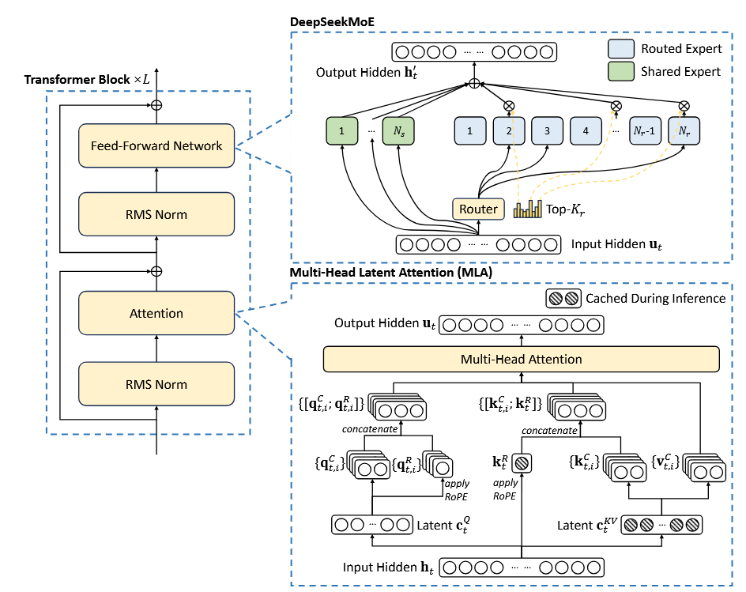
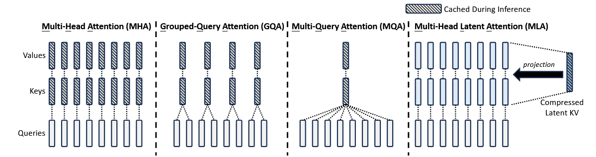
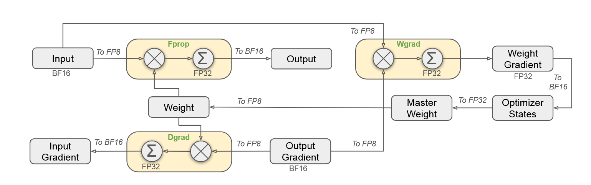
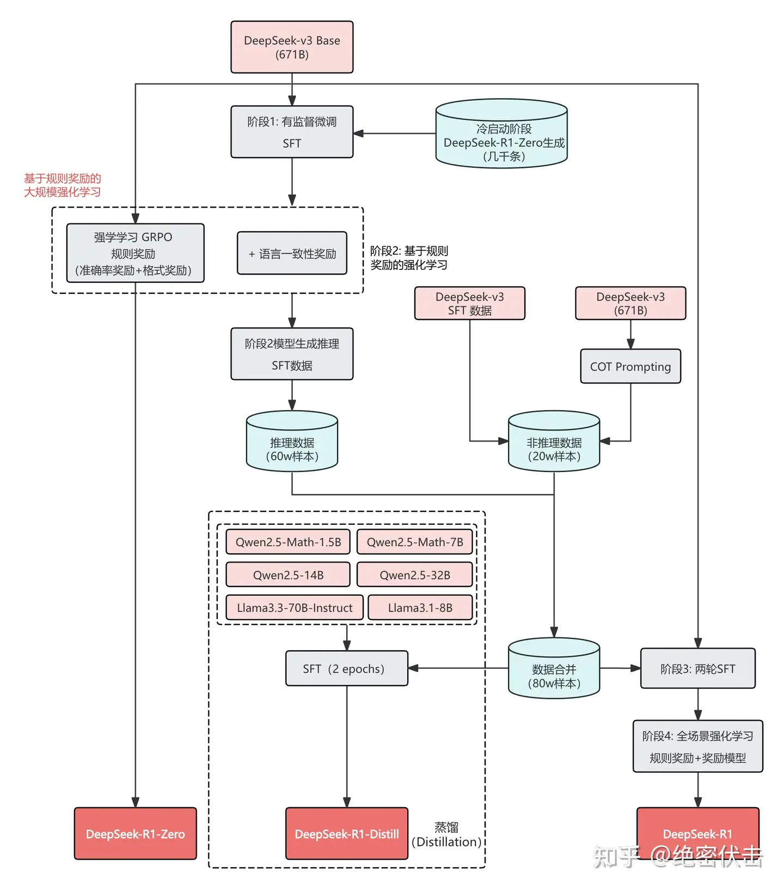
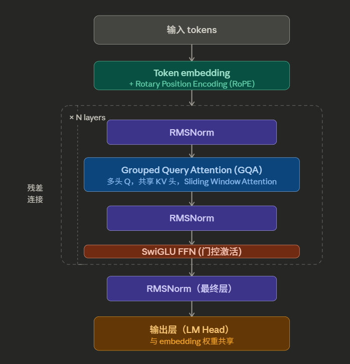
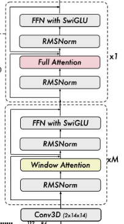
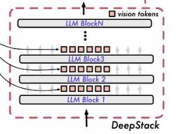
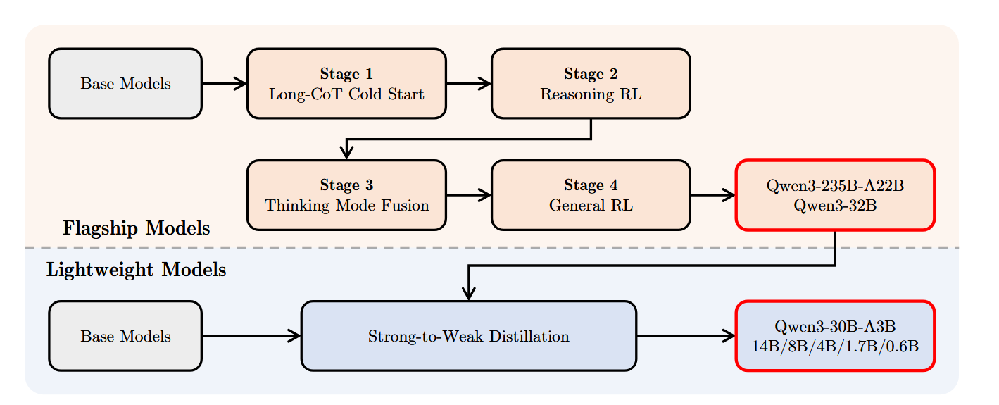

> DeepSeek历程

# DeepSeekMath-7B

+++

在Coder-base 模型上继续预训练，使用的都是数学相关token，目的是强化数学推理能力。提出了GRPO，奖励模型采用过程奖励模型（PRM）方法

# DeepSeek-V2 技术报告

+++

## 技术特点：

* 提出了MLA（多头潜在注意力） 和 DeepSeekMoE（V3中介绍）

* MLA 的出发点是：KV Cache 存的是高维向量，但这些向量所在的流形其实是低维的，可以先压缩再存，用时再解压。具体做法是，不直接缓存 K 和 V，而是缓存一个**低维的潜在向量**（latent vector）** $c^{KV} $
  $$
  c^{KV} = W^{DKV} \cdot h
  $$
  其中 $W^{DKV} $ 是一个**降维投影矩阵**，$h $ 是该 token 的隐藏状态。$c^{KV} $ 的维度远小于原始 KV 的维度。推理时，需要用 K 和 V 时再通过**升维矩阵** $W^{UK} $、$W^{UV} $ 还原：
  $$
  K = W^{UK} \cdot c^{KV}, \quad V = W^{UV} \cdot c^{KV}
  $$
  实际存入 KV Cache 的只有 $c^{KV} $，而不是完整的 K 和 V。这就是"**低秩联合压缩**"名称的由来——K 和 V 共享同一个低维压缩表示。

  
  
* **Query 侧的额外处理：解耦 RoPE**

  引入低秩压缩之后有一个技术障碍：**位置编码（RoPE）与低秩压缩不兼容**。

  ​	RoPE 是一种相对位置编码，它**直接作用在 Q 和 K 向量**上，对不同位置的向量做旋转变换。问题在于，如果 K 是从压缩的 $c^{KV} $ 实时解压出来的，那么 RoPE 的旋转就无法在压缩阶段提前施加，必须在解压之后才能做，这会**破坏缓存复用的逻辑**。

  ​	MLA 的解决方案是**解耦 RoPE（Decoupled RoPE）**：在原有的低秩压缩 Q/K 之外，额外生成一组专门用于携带位置信息的 Q 和 K 轻量向量（记作 $q^R $、$k^R $），只在这组向量上施加 RoPE，然后把它们拼接到主 Q/K 上参与注意力计算。这样，压缩的主体 K 完全不涉及 RoPE，可以安全地缓存和复用；位置信息由独立的通道单独处理。

# DeepSeek-V3 技术报告

+++

## 技术特点

### MTP

1. 借鉴了 Meta FAIR 团队论文：[Better & Faster Large Language Models via Multi-token Prediction](https://arxiv.org/pdf/2404.19737) 中的思路，使用了**MTP**（Multi-token Prediction）

   

​	$\mathbf{h}_i^{\prime k}=M_k[\mathrm{RMSNorm}(\mathbf{h}_i^{k-1});\mathrm{RMSNorm}(\mathrm{Emb}(t_{i+k}))],$

​	$\mathbf{h}_{1:T-K}^{k}=TRM_k(\mathbf{h}_{1:T-K}^{\prime k})$

​	$P_{i+k+1}^k=OutHead(h_i^k)$
$$
\mathcal{L} = -\sum_t \sum_{k=1}^{D} \lambda_k \log P_k(x_{t+k} \mid x_1, \dots, x_t)
$$
V3 不是简单地在主干网络顶部接多个独立的线性头，而是为每个额外**预测深度**设计了一个独立的 **MTP 模块**，每个模块包含一个完整的 Transformer 层加一个预测头

第 $k $ 个 MTP 模块的输入，是主干网络在位置 $t $ 的**隐藏状态** $h_t^{(k-1)} $（第一个模块用主干最后一层的输出），以及位置 $t+k $ 处 token 的 embedding，两者经过RMS Norm，拼接后通过线性矩阵投影，送入该模块的 Transformer 层，输出新的隐藏状态 $h_t^{(k)} $，再接预测头输出 $P(x_{t+k+1}) $。

> 每个MTP模块的输入由两个部分组成：上一个模块的隐藏状态和预测的前一个token的embedding

关键的设计细节是：**所有 MTP 模块与主干网络共享 embedding 层和输出的 unembedding 矩阵（lm head）**，不引入额外的词表相关参数。这使得 MTP 模块的参数量很小，额外的计算开销有限。

###  **DeepSeekMoE**

1. MoE思想（稀疏激活）：

   在标准 Transformer 中，每个 token 都会经过完全相同的 FFN（前馈网络）层处理。MoE 的做法是把这个 FFN 层替换成 $N $ 个并行的"专家网络"（每个专家本质上仍是一个 FFN），再加一个 **路由器（Router）**。路由器对每个输入 token 计算一个软权重分布，然后只选出 Top-K 个专家参与计算，其余专家对该 token 完全不激活。最终输出是被选中的专家输出的加权求和：

2. **MoE 存在的问题：**

   1. 知识冗余。基础知识在所有领域都要用到，被不同expert重复学习
   2. 知识杂糅。expert数量不够时，专业化程度不高。比如2个expert划分为文科理科，更多expert则可以划分为语文、数学、科学、地理等。
   3. 负载不均衡（Expert Collapse专家塌陷）：Rounter 倾向选择固定的几个expert完成任务，导致大多数专家几乎从不被训练，模型退化为只有少数几个专家实际工作的状态。
   4. 集群通讯问题（V3解决）。不同专家在不同设备上，计算速度远快于通讯。
      * 多机部署：MoE层的不同Expert线性层分布到不同设备，其他网络层则复制。
   5. batch size 减小。由于稀疏激活的原因，batch size会被切分，导致不是所有expert都接受batch size的数据。

3. **DeepseekMoE 技术改进：**

   DeepSeekMoE在其他MoE工作的基础上，主要的两个改进：

   1. 细粒度专家划分。对Expert的粒度进行细分，提供更多样的expert激活组合，同时为了保持相同的计算消耗，等比例减少每个expert FFN的隐藏层维度

   2. 共享expert隔离（Shared Expert Isolation）。专门保留若干个专家作为"共享专家"，对所有 token 无条件激活，负责学习跨领域的通用知识

   3. 负载均衡损失函数设计。

      1. **动态偏置调整 expert balance**
         - 实时监控每个专家被选中的频率

         - 如果某个专家过载，在计算分数时减去一个偏置值，降低其被选中的概率

         - 如果某个专家闲置，则加上一个偏置值，提高其被选中的概率

      2. 设备限制

         - device-level：DeepSeek还将专家分布在多个GPU上，并限制单个Token激活的专家不超过M台设备。这样做的好处是：减少跨设备通信的开销、保证推理速度
         - expert/device/communication balance 机制把负载拉平，一边用 device-limited 或 node-limited routing 把 token 的跨设备范围限制住，从而在“模型效果、设备均衡、通信开销”之间取得平衡。

### FP8混合精度

每一轮得到的output梯度（上一轮反向传播过来的）根据本轮的input计算本轮的权重梯度用于更新weight梯度；

每一轮的output梯度再求的对于输入的梯度（对输入求偏导得到与weight相关的式子，所以加入了Weight）作为上一轮的输入梯度；

> BF16 之所以成为大模型训练的主流，是因为它保留了和 FP32 相同的指数位数，动态范围一致，溢出风险极低，只是牺牲了尾数精度。

* 主流的三种精度FP32、BF16、FP8

  | 精度 | 位数 | 特点                      | 用途             |
  | ---- | ---- | ------------------------- | ---------------- |
  | FP32 | 32位 | 精度高，显存大（e8m23）   | 累加、优化器状态 |
  | BF16 | 16位 | 动态范围大，速度快(e8m7)  | 激活值、梯度传递 |
  | FP8  | 8位  | 极快，显存最小(e5m2 e4m3) | 矩阵乘法计算核   |

V3 同时使用了两种 FP8 格式：**不同操作用不同精度，在速度和精度之间取得平衡**。对于GEMM，矩阵乘法本身对精度不敏感，但梯度累加对精度非常敏感。所以计算用低精度，累加用高精度。

**精细化缩放（Fine-grained Quantization）**

量化的标准做法是给每个张量维护一个缩放因子 $s $，量化时除以 $s $ 把数值映射到 FP8 范围内，反量化时再乘回 $s $：
$$
x_{FP8} = \text{round}\left(\frac{x}{s}\right), \quad x_{\text{restored}} = x_{FP8} \times s
$$
FP8 的最大收益来自矩阵乘法（GEMM），H800 的 FP8 Tensor Core 吞吐量是 BF16 的两倍

> **注意力机制中的 softmax**：attention logit 的数值范围在长序列中可能很大，且 softmax 对数值精度极敏感，轻微的量化误差会显著改变注意力分布。V3 在 softmax 前后都保持 BF16。
>
> **梯度累积（Gradient Accumulation）**：多个 micro-batch 的梯度在累积求和时，如果每个都是 FP8，累积误差会快速放大。V3 在梯度累积阶段提升到 FP32。
>
> **权重更新（Optimizer States）**：Adam 优化器的一阶矩、二阶矩估计以及主权重（master weights）全部保持 FP32，只在实际参与矩阵乘法时才转换为 FP8。这是混合精度训练的标准范式，V3 在此基础上把工作精度从 BF16 进一步压缩到 FP8。
>
> **Embedding 层和输出层（lm head）**：输入输出 token 的 embedding 查找和最终的 logit 计算保持 BF16，因为这两层直接影响 token 预测的数值准确性。

### DualPipe流水线并行

解决了PP中Bubble的问题：每个 micro-batch 在流水线的首尾阶段，总有一些设备处于空闲等待状态，GPU 利用率因此下降

+++

# OpenAI-o1

## 长思维链

o1在**后训练阶段**引入了大规模的强化学习，专门训练其推理能力

* 重点学习的推理能力：
  1. **识别和纠正错误**：在推理中途发现自己走错了路，能够回头。
  2. **分解复杂步骤**：将难题拆解为一系列更简单、可处理的小问题。
  3. **尝试不同策略**：当一种方法行不通时，会灵活地切换到另一种思路。
  4. **产生"合理推理过程"**：这不仅仅是分步作答，更包含了"为什么这样做"的分析和思考，使得推理过程更具深度和可解释性。

这种训练方式的精髓在于，它将思维链从一种由提示词触发的"外部技巧"，转化为了模型内部的"**本能能力**"。这使得o1在应对从未见过的复杂问题时，能够自主地、有条理地展开思考

在**推理**时，动态决定思考时间：

* **隐藏的内部思维链**：当你向o1提问时，它首先会在内部生成一段**不展示给用户**的、极长的思维链。这个"隐藏"的设计很关键，它允许模型不受拘束地进行各种尝试、自我反思甚至纠错，而不用担心将混乱的思考过程暴露给用户。
* **动态资源分配**：OpenAI的研究发现，通过优化测试时的计算，可以在不增加模型规模的情况下显著提高性能。这意味着o1能根据问题的复杂度，**动态地分配计算资源**。面对简单问题，它"思考"时间短；面对奥数题或复杂编程问题，它能够调用更长的计算时间，生成更深入的思维链，以换取更高质量的答案。
* **安全性的副产品**：有趣的是，这种内置的思考过程也带来了安全性的提升。通过在思维链中显式地推理OpenAI的安全政策，o1在抵御恶意提示词（越狱攻击）和生成不安全内容方面的表现远超前代模型。这被称为**深思熟虑的对齐**。

+++

# Deepseek-R1 技术报告

https://www.zhihu.com/tardis/zm/art/19868935152?source_id=1003

## R1-Zero

* 在 V3-base 预训练上直接进行 RL，不使用任何 SFT 数据。

* 提出了基于**规则的奖励系统**，分为两种奖励：

  1. 准确率奖励
  2. 格式奖励

  没有使用 PRM 和 ORM
  
  > RLVR，全称为**基于可验证奖励的强化学习**（Reinforcement Learning with Verifiable Rewards）。它是DeepSeek-R1中用来激发模型强大推理能力的一项核心技术。
  >
  > 主要规则：
  >
  > - **准确性奖励**：这是最核心的奖励，直接判断答案是否正确。正确通常得1分，错误则得0分或-1分。这是RLVR引导模型找到正确答案的根本动力。
  > - **格式奖励**：为了便于解析和训练，模型通常需要按照指定的格式输出推理过程和答案，例如将思考内容放在`<think></think>`标签内，最终答案放在`<answer></answer>`标签内。符合格式会获得奖励。
  > - **长度奖励**：这类奖励可以灵活调整训练目标。有时为了鼓励模型进行更深入的探索，会奖励生成更长的思考链；有时则为了追求效率，会奖励在保证准确性的前提下更简洁的回答。
  > - **语言一致性规则**

## R1

* 提出了多阶段训练策略（冷启动->RL->SFT->全场景 RL），冷启动强化学习

  1. 阶段1：使用少量高质量的 CoT 数据进行冷启动，预热模型。
  2. 阶段2：进行面向推理的强化学习，提升模型在推理任务上的性能。
  3. 阶段3：使用拒绝采样和监督微调，进一步提升模型的综合能力。
  4. 阶段4：进行全场景强化学习，使模型在所有场景下都表现良好。

  

* 冷启动优势：

  1. 提升可读性：使用的是高质量 CoT 数据，引导模型输出人类可读的推理格式
  2. 稳定训练：避免 RL 早期训练不稳定问题
  3. 提升性能：引导模型拥有更好的推理能力

* 冷启动训练数据：V3 根据长思维链的 few-shot 生成高质量的 CoT 数据 以及 R1-Zero 生成数据并经过人工标注细化

* 阶段二在引入：**语言一致性奖励**

  

* 阶段三：使用上一阶段的 RL 模型进行**拒绝采样**，生成高质量的推理和非推理数据，并用这些数据对模型进行微调。侧重点是提升模型的**综合能力**

* 阶段四：再次进行强化学习，（规则奖励+奖励模型）

提出了 RLVR

## R1-Distill

使用 R1 阶段三 两次 SFT 的 80w 数据，使用小模型直接进行一个off-policy的SFT

> ### 1. 为什么需要拒绝采样？
>
> 在大规模强化学习（RL）阶段之后，模型已经学会了通过长思维链进行推理和反思。但RL训练过程本身是嘈杂的，模型会生成各种各样的推理路径：
>
> - 有些路径虽然最终答案正确，但推理过程冗长、混乱或包含无用信息。
> - 有些路径甚至最终答案是错误的。
>
> 如果直接用这些RL产生的混合数据去训练模型，会把“坏习惯”也教给模型。因此，需要一个**过滤器**，只挑选出**最好**的那一批数据。
>
> ### 2. 拒绝采样的具体做法
>
> 这个过程通常分为两步：
>
> #### 第一步：生成（采样）
>
> - **输入**：给训练好的模型（如DeepSeek-R1的一个阶段性版本）大量的提示（Prompt），这些提示通常是数学、编程或逻辑推理问题。
> - **过程**：对于每一个问题，让模型生成**多个**答案（例如，让模型对同一道题回答16次或64次）。由于模型的生成具有随机性（比如温度系数temperature > 0），这多次生成的推理路径和最终答案都会有所不同。
>
> #### 第二步：拒绝（筛选）
>
> - **评判**：利用某种“裁判”来评估这些生成的答案。
>   - **规则验证**：对于数学题，可以看最终答案是否匹配标准答案；对于编程题，可以看代码能否通过所有测试用例。这是最可靠的“金标准”。
>   - **奖励模型（Reward Model）**：对于没有标准答案的开放性问题，可以训练一个奖励模型来给生成的答案打分，评估其逻辑性、有用性和无害性。
> - **筛选**：根据评判结果，**只保留**那些被判定为“正确”或“高分”的样本。对于错误的、低分的样本，直接**拒绝（丢弃）**。
> - **格式化**：将保留下来的高质量样本整理成标准的输入-输出对（即“问题”+“包含长思维链的正确答案”）。

# Qwen-2.5

+++

> 结合 **YaRN** 这种长度外推技术来扩展 RoPE 的可用范围、

## GQA

* 多头Q，共享KV，大幅降低 KV Cache 显存占用
* 同时引入 Sliding Window Attention，兼顾长上下文与计算效率
* FFN 层使用 SwiGLU 门控激活

## 训练过程

1. 预训练（18T token，多语言、代码、数学），进行上长下文扩展（）
2. SFT：
3. RLHF：
   1. DPO 主要用于通用对话的无害性和帮助性对齐：人类偏好对齐、结构化数据理解
   2. GRPO 则专门用于数学和代码等有明确验证信号的推理任务：指令跟随、长文本生成稳定性、结构化输出能力。

# Qwen-2 VL

+++

> 解决了两个问题：
>
> 1. 不同尺寸图片怎么高效表示
> 2. 文本、图片、视频的位置怎么统一建模

## 关键组件

### 视觉编码器：ViT

* **动态分辨率处理**：没有把所有图片都强行缩放到固定分辨率，而是引入了 **Naive Dynamic Resolution**。

  训练时会动态调整每一帧的分辨率，为每一个视频限制了 token

  * 传统的视觉语言模型比如CLIP，通常都是将图像强制缩放到224x224，以固定 token 数量（应该是为了**绝对位置编码**）

* **Multimodal Rotary Position Embedding (M-RoPE)**：把原本只适合“一维文本序列”的 RoPE，扩展成同时能表示“文本顺序 + 图像二维位置 + 视频三维位置”的位置编码

  把旋转嵌入分解为三个维度：

  1. 时间维 t：temporal
  2. 高度维 h：height
  3. 宽度维 w：width

  对于视频输入来说：体现了**同一空间位置在不同时间的变化**；和**同一帧中不同空间位置的差异**

  有助于长序列外推：如果你把高分辨率图像或长视频粗暴展平成一个超长 1D 序列，position ID 会涨得很快。 而 M-RoPE 把位置拆到 t/h/w 三个轴上后，每个轴各自的取值更“规整”，不需要把所有复杂结构都堆在一条超长位置轴上。

  * 计算：对于一个 attention head，**把这 head 的隐藏维度 `d` 切成三段**chunking，每段独立用不同的旋转嵌入维度计算旋转角。三段分别旋转完之后，**直接拼回**原来的顺序，还是一个长度 `d` 的向量

* **图像和视频的统一理解框架**：

  * 图像被处理为两个相同帧，图像输入和视频输入在形式上就统一
  * 使用 3D tubes 替代 2D patches 处理方式：视频都是每秒2帧，**并且对相邻两帧（depth=2）对应位置的patch用 3D 卷积把两帧合并提特征，这样可以在不增加序列长度的前提下处理更多视频帧。**

* 流程：图像经过ViT编码，输出一组视觉token，通过2x2相邻的token进行压缩（在维度上进行concat patch merging），再通过一个MLP将维度投影到LLM的embedding层的维度，然后与文本进行拼接

### LLM

* 使用 Qwen-2

## 训练流程

### 阶段一：ViT预训练

* 目标：冻结LLM，用大量图文对数据，让模型先建立基础的视觉-语言对齐能力
  * 图文关系
  * 图中文字识别：OCR
  * 图像分类等基础能力
* Qwen2-VL 的 LLM 部分是用 **Qwen2** 初始化，视觉编码器则基于 DFN 的 ViT 初始化，并把原来固定位置编码替换成了 **2D RoPE**
* 训练范式还是**视觉输入** **辅助文本生成/理解**的生成式预训练，损失函数还是交叉熵（对文本位置）

### 阶段二：大规模多模态预训练

* 目标：**解冻全部参数**，引入更多混合数据继续训练，让模型学会把视觉信息真正纳入语言推理和生成流程

  * 混合图文数据（mixed image-text）：OCR 、文档、图表

    视觉问答数据（VQA）

    视频对话数据（video dialogues）

    图像知识类数据（image knowledge datasets）

    纯文本数据

* 而且纯文本数据仍然保留，用来维持语言能力

  

### 阶段三：冻结ViT，对LLM进行指令微调

* 目标：把“基础多模态模型”变成一个**可聊天、可问答、可执行复杂指令**的 Instruct 模型
  - 纯文本对话
  - 图像问答
  - 文档解析
  - 多图比较
  - 视频理解
  - 视频流式对话
  - agent 交互任务

# Qwen-2.5 VL 

+++

> 在 ViT 架构里效仿 LLM 用 **RMSNorm** 进行归一化，并使用 **SwiGLU** 作为激活函数，同时用**窗口注意力**减少计算量；在多模态旋转编码 MRoPE 里引入**绝对时间**

## 模型架构

### LLM

* 初始化为 Qwen2.5 的预训练权重

### Vision Encoder

* **ViT 从头重新训练 + Window Attention：**重新设计了 ViT 并从头开始训练，集成了 2D-RoPE 和窗口注意力（只有少部分采用完整自注意力），支持**原生输入分辨率**，同时加速整个视觉编码器的计算

  * 训练流程： CLIP 预训练、视觉-语言对齐和端到端微调

* **在多模态旋转编码 M-RoPE 引入了绝对时间**：可以实现**秒级事件定位**，模型可以原生感知空间尺度和**时间动态**

* **动态FPS采样**：引入了 Dynamic FPS 采样策略，根据**视频内容的时间密度**自适应调整**采帧速率**，动作密集的片段采样更密，静止片段采样稀疏，**在保持语义完整性的同时减少冗余 token**。

* **精细化感知能力**：能用 bounding box 或点坐标精确定位目标，同时提供从发票、表单、表格中提取结构化数据，以及对图表、图示和页面布局的详细分析

  * 原因：训练数据中带有大量坐标标注的数据；M-RoPE为每个token携带了空间位置编码，让坐标输出有了可靠的空间锚点

  

  

  

### Connector：MLP-based Vision-Language Merger（视觉语言融合的MLP模块）

* vision encode 输出的特征会通过一个**基于 MLP** 的模块进行压缩和映射，再送入语言模型进行处理，实现了两种模态的高效对齐
* 为了应对长序列图像特征带来的效率挑战，我们采用了一种简单但有效的方法：在输入大型语言模型（LLM）前先压缩特征序列。具体来说，我们没有直接使用由视觉变换器（ViT）提取的原始补丁特征，而是先将空间相邻的四个补丁特征分组。这些分组特征随后被串接，并通过两层多层感知器（MLP）传递，将其投影到与LLM中使用的文本嵌入对齐的维度中。该方法不仅降低了计算成本，还提供了灵活的方式来动态压缩不同长度的图像特征序列。

## 训练流程

### 训练数据：

* **交错图文数据:** 通过数据评分和清洗流程，确保使用高质量、相关的交错数据。评分标准包括：
  - 文本质量 (Text-only quality)
  - 图文相关性 (Image-text relevance)
  - 图文互补性 (Image-text complementarity)
  - 信息密度平衡 (Information density balance)
* **绝对位置坐标的grounding数据:** 使用基于输入图像实际尺寸的坐标值来表示边界框和点，提高模型对真实世界尺度和空间关系的捕捉能力。
* **文档全解析数据:** 合成包含表格、图表、公式、图像、乐谱、化学式等多种元素的文档数据，并以 HTML 格式统一表示，实现多模态文档元素的无缝集成。
* **OCR 数据:** 收集和整理来自不同来源的 OCR 数据，包括合成数据、开源数据和内部收集的数据，并支持多种语言。
* **视频数据:** 动态采样 FPS，构建长视频标题，并以秒和时分秒帧 (hmsf) 格式表示时间戳。
* **智能体数据:** 收集移动、Web 和桌面平台的屏幕截图，并使用合成数据引擎生成屏幕截图标题和 UI 元素接地注释。

### 预训练

1. **视觉预训练:** 仅训练 ViT，使用图像标题、视觉知识和 OCR 数据。
2. **多模态预训练:** 解冻所有模型参数，使用交错数据、VQA、视频、智能体等多种数据。
3. **长上下文预训练:** 引入视频、智能体数据，并增加序列长度。

### 后训练

1. SFT：

   SFT阶段用到的 instruction data 包含约 200 万条数据，50% 为纯文本数据，50% 为多模态数据（图文和视频文本）。在数据过滤流程中，先使用 Qwen2-VL-Instag （一个基于Qwen2-VL的分类模型）将 QA 对分层分类为 8 个主要领域和 30 个细粒度子类别，然后对于这些细分类别，使用**领域定制过滤，**结合基于规则和基于模型的过滤方法。

   - **基于规则的过滤:** 删除重复模式、不完整或格式错误的条目，以及不相关或可能导致有害输出的查询和答案。
   - **基于模型的过滤:** 使用 Qwen2.5-VL 系列训练的奖励模型评估多模态 QA 对。

   此外，在训练中还使用**拒绝采样 (Rejection Sampling)**技术，增强模型的推理能力。使用一个中间版本的 Qwen2.5-VL 模型，对带有标注（ground truth）的数据集生成响应，将模型生成的响应与标注的正确答案进行比较，只保留模型输出与正确答案匹配的样本，丢弃不匹配的样本。

2. DPO：报告中基本一笔带过。仅使用图文和纯文本数据，不使用视频数据，利用偏好数据将模型与人类偏好对齐。
# Qwen-3 VL
+++

Qwen3-VL 系列包含 **Dense 模型** 与 **MoE 模型**

## 模型架构

### Vision Encoder

* 采用了**SigLIP-2**架构
  * **CLIP** 中，正负样本是 pairwise 建模的，用的是 **infoNCE 对比损失**。global batch size一般都很大（如32k），这意味着GPU 1上的正样本需要见到其他所有GPU上的样本，并以此作为负样本。因此通常都需要汇聚多节点多卡的特征向量，这个时候需要频繁地调用`all_gather`，带来了沉重的通信代价，也会拖慢整个训练过程的速度。
  * **SigLIP**中，正负样本是 pointwise 建模的，是 **sigmoid 二分类损失**，把每个图文对独立地当作一个二分类问题来处理，在涉及到本地的正样本和其他设备的负样本进行交互计算的时候，仅需要很少的`gather`操作就能完成设备间向量的交换，不需要 `all_gather`

### 交错式多维旋转位置编码 (Interleaved MRoPE)

* 原有设计将 embedding 维度分块（Chunking），分别分配给 t, h, w。研究观察到，这种分块策略会导致**频率谱（Frequency Spectrum）不平衡**。具体而言，某些维度可能只包含低频信息，而其他维度包含高频信息，这会损害长视频理解能力。
* Qwen3-VL 采用了交错式（Interleaved）设计。通过在嵌入维度上交错分配 t, h, w 的分量，确保空间时间信息分布均匀

### DeepStack 跨层融合机制

* 为了加强视觉与语言模态的对齐，Qwen3-VL 引入了 DeepStack 机制。(在 MLP Merger 层)
* **设计动机：** 传统的 VLM 通常仅将视觉编码器的最终层输出作为 LLM 的输入。这种方式 LLM 拿到的是一个"已经高度抽象"的视觉表征，丢失视觉编码器中间层包含的低级或细粒度视觉信息（边缘、纹理、颜色、形状等）。
* **实现方式：** 对每个选定的 ViT 层（l₁、l₂、l₃），使用独立的 MLP Merger 将 patch token 投影到 LLM 的隐藏维度，然后通过残差加法在 LLM 第 1-3 层注入。这种方式在不增加序列长度的情况下，为 LLM 提供了低层和高层的视觉语义。
* **优势：** 这种设计不增加额外的上下文长度，但在不显著增加计算开销的情况下，增强了模型对多尺度视觉特征的利用能力。

  

  

### 基于文本的视频时间戳 (Explicit Video Timestamps)

相对帧序号-绝对时间戳-显式的文本时间戳

* Qwen2.5-VL 使用**绝对时间位置编码**
  * 对于长视频，绝对时间位置 ID 会变得非常大且稀疏，影响长上下文外推。
  * 需要对不同帧率（FPS）进行广泛采样以学习时间对应关系，增加了数据构建成本。
* Qwen3-VL采用**显式文本时间戳 token**。
  - 每个视频时间片段前会插入格式化的文本字符串，例如 `<3.0 seconds>`。
  - 训练过程中，同时使用秒（Seconds）和时分秒（HMS）格式，以增强模型对不同时间表示的鲁棒性。
  - 虽然这略微增加了上下文长度（Text tokens），但它提供了更直接的时间语义，有助于视频定位（Grounding）和密集描述（Dense Captioning）任务。
  - 时间推理变成文本推理；跨帧率一致性更强；与语言能力自然对齐

|          |   Qwen2-VL    |          Qwen2.5-VL           |    Qwen3-VL    |
| :------: | :-----------: | :---------------------------: | :------------: |
|   ViT    | 复用DFN的 ViT | 从头训练，加 Window Attention |                |
| 时间编码 |  相对帧序号   |      绝对时间戳（秒级）       | 文本时间戳对齐 |
| 视频采样 |   固定 FPS    |           动态 FPS            |                |
| 定位能力 |     基础      | bounding box / 点坐标精确定位 |                |
| LLM 底座 |     Qwen2     |            Qwen2.5            |                |

## 训练流程

#### 预训练

* **S0：视觉-语言对齐（Vision-Language Alignment）**
  * 目标**：** 弥合视觉与语言模态的差距。
  * 参数更新： 仅训练 MLP 适配器（Merger），冻结视觉编码器和 LLM。
  * 数据**：** 约 67B token，包含高质量图文对、视觉知识和 OCR 数据。
* **S1: 多模态预训练 (Multimodal Pre-Training)**
  * 目标**：** 全参数端到端训练。
  * 参数更新**：** 解冻视觉编码器、Merger 和 LLM。
  * 数据： 约 1T token。混合了纯文本数据和多模态数据（图文交错文档、视觉定位、VQA、STEM 数据）。
  * 序列长度**：** 8,192。
* **S2: 长上下文预训练 (Long-Context Pre-Training)**
  * 目标**：** 扩展上下文窗口，增强长文档和视频理解。
  * 序列长度**：** 提升至 32,768。
  * 数据**：** 约 1T token。增加了纯文本长文档的比例，多模态数据中引入更多视频和 Agent 指令跟随数据。
* **S3: 超长上下文适应 (Ultra-Long-Context Adaptation)**
  * 目标**：** 极限扩展上下文能力。
  * 序列长度**：** 提升至 262,144 (256K)。
  * 数据： 约 100B token。专注于长视频和长文档分析任务。
  * 优化**：** 使用平方根重加权（Square-root reweighting）策略来平衡文本和多模态数据的损失，避免某一模态主导梯度。

#### 后训练

​	

# Qwen-3

+++

## 训练流程：

### pre-training

1. **第一阶段（通用阶段 S1）**：在超过 30 万亿 token 上训练，序列长度 4096，覆盖 119 种语言，建立语言能力和通用世界知识基础。
2. **第二阶段（推理强化阶段 S2）**：增加 STEM、编程、推理和合成数据的比例，在约 5 万亿更高质量的 token 上继续训练，同时加速学习率衰减。
3. **第三阶段（长上下文阶段）**：在数千亿 token 上进行长文本训练，将上下文长度从 4096 扩展到 32768。其中 75% 数据长度在 16384–32768 之间，25% 在 4096–16384 之间。采用 ABF 技术将 RoPE 基础频率从 10000 提升到 100 万，并引入 YARN 和 Dual Chunk Attention（DCA）实现推理时 4 倍序列长度扩展。

### post-training

1. **第一阶段（Long-CoT 冷启动微调）**：通过长链式思维（Long Chain-of-Thought）的监督微调，为模型建立初步的复杂推理能力。
2. **第二阶段（推理强化学习）**：以数学和编程任务为重点进行强化学习，进一步增强推理能力。
3. **第三阶段（思考模式融合）**：将包含推理路径和不含推理路径的数据混合成统一数据集进行微调，使模型能够同时支持思考和非思考两种输入方式。 
4. **第四阶段（通用域强化学习）**：在更广泛的下游任务上施加通用域强化学习，提升模型在各类任务上的综合表现。

## 数据蒸馏

**Off-policy Distillation（离线蒸馏）**

教师模型**提前生成**一批静态数据集，学生模型直接在上面训练，两者之间没有在线交互。一般作为冷启动

* SFT：教师生成高质量的问答对，学生做标准的 next-token 预测
* 知识蒸馏（KD）：不只用最终答案，还对齐教师的 **logits 分布**（软标签）。学生不仅学"说什么"，还学"怎么分配概率"，信息量更丰富，但需要访问教师的 logits（API 通常不提供）。

缺点是数据分布是教师的，不是学生自己的，存在**分布偏移**问题。

------

**On-policy Distillation（在线蒸馏）**

学生模型**自己生成输出**，再由教师/奖励模型来打分或过滤，形成动态闭环。

* 拒绝采样（Rejection Sampling）：学生生成多条候选，教师或验证器选出正确/高质量的那条，拿来继续训练。
* RL 反馈蒸馏（RLHF / DPO）：用教师偏好或规则奖励对学生的输出做强化学习，直接优化分布而非模仿固定样本。

数据始终来自学生自身分布，**不存在 off-policy 的分布偏移**，但计算成本高，训练不稳定。

> **on-policy**：用于梯度更新的数据，必须是**当前被更新的策略** $\pi_\theta $ 采样的。
>
> **off-policy**：用于梯度更新的数据，是**另一个策略**采样的。
