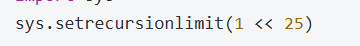

# 笔试算法

+++

## 图论 树

### 搜索算法

岛屿数量、腐烂橘子、课程表（有向图+BFS）

#### DFS（回溯法）

* 栈或者递归
* 本质就是二叉树前序遍历

#### BFS

* 对列
* 例题：迷宫最短路径

#### 树

二叉搜索树的中序遍历是一个升序数组

* 前序遍历
* 中序遍历
* 后序遍历

## 栈

* 最小栈（往后第一次出现的比当日温度高的日子）
* 有效的括号

## 堆

+++

## 序列题：

* 最长数字连续序列
* 无重复字符的最长子串
* 找到字符串中所有字母异位词
* 和为K的子数组
* 滑动窗口最大值
* 最小覆盖子串

