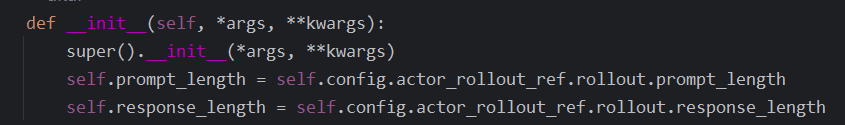

装饰器register




参数定义在哪


gpt-oss 模型强制要求使用 Harmony 格式进行交互


**PRM ORM**


```
Sticky session: send multi-turn chat completions to same server for automatic prefix caching
```

`heapq.heapify` 将其转换为一个最小堆，堆顶元素是负载计数最小的服务器。计数初始为 0。

为什么要使用堆

+++


常规方法：BM25关键字检索、RAG （repo作为文档进行检索）

数据加载是在本地还是直接调用huggingface上的

“**Parquet 格式**的文件”是什么 `二进制的文件储存，跟csv和json行存储不一样，是列存储的，比如所有prompt都在一个列中，读取比较快`

训练过程：准备数据（Parquet）、prompt拼接好后、模型多次采样generate_sequence，只提取assistant的token参与后续计算，计算reward ngcg@5，优势、计算PPO clip loss

+++


